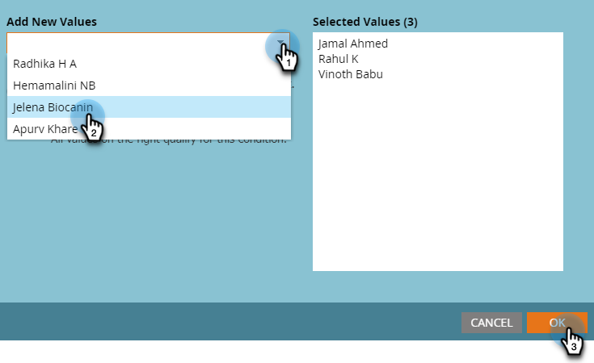

# User and License Management {#user-and-license-management}

Intro.

## Add a User {#add-a-user}

1. Go to the **Admin** area.

   

1. Click **Interactive Webinars**.

   

1. Click **Add/Remove Users**.

   

1. Click the Available Users drop-down, select the user(s) you wish to add, and click **OK**.

   

## Remove a User {#remove-a-user}

1. Go to the **Admin** area.

   

1. Click **Interactive Webinars**.

   

1. Click **Add/Remove Users**.

   

1. Highlight the user(s) you want removed and press the Delete key on your keyboard. Click **OK** when done.

   

## License Usage {#license-usage}

Every time a license is added, a new license usage box will appear.

1. Go to the **Admin** area.

   

1. Click **Interactive Webinars**.

   

1. INFO

PICC
