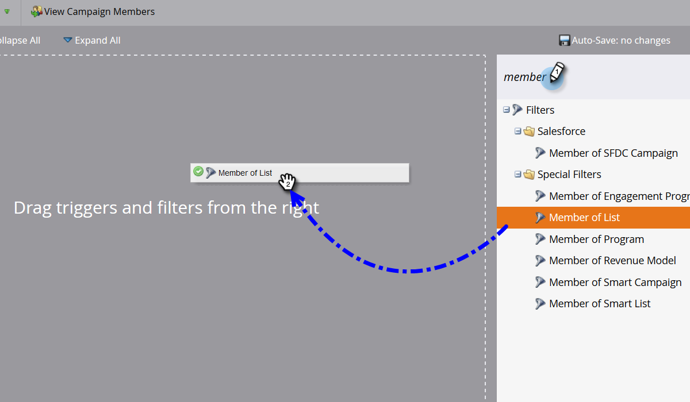
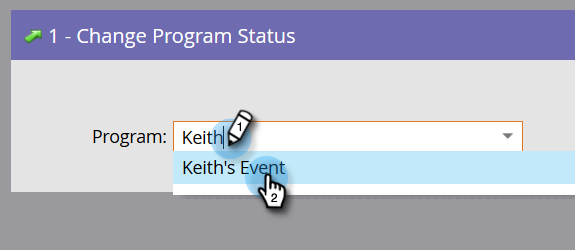
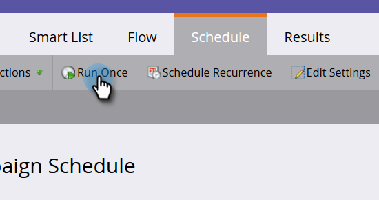
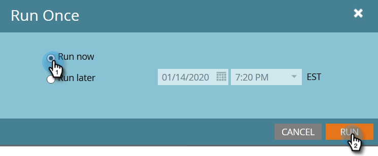

# Adding Members to an Event Program {#adding-members-to-an-event-program}

This article only applies to users who utilize Event Cap or Event Goals.

>[!CAUTION]
>
>Importing a list of people directly into an Event Program will prevent those records from being counted in actual registrations in the Goal Tracking report, and the Event Cap Progression report. Follow the instructions below to ensure your records are counted.

1. Create and [add people to a static list](http://docs.marketo.com/x/ecKt).
1. [Create a smart campaign](http://docs.marketo.com/x/M4AR).
1. In the Smart List of the Smart Campaign you created in Step Two, find and add the **Member of List** filter.

   

1. Find and select the list you created in Step One.
1. 

1. In the Flow, find and add the **Change Program Status** flow step.
1. 

1. Find and select your Event Program.

   

1. Choose your desired status.

   

1. In the Schedule tab, click **Run Once**.
1. 

1. Select **Run Now** and click **Run**.
1. 

1. After the smart campaign runs, the members get added to the program and will count in Goal Tracking and Event Cap Progression calculations.

