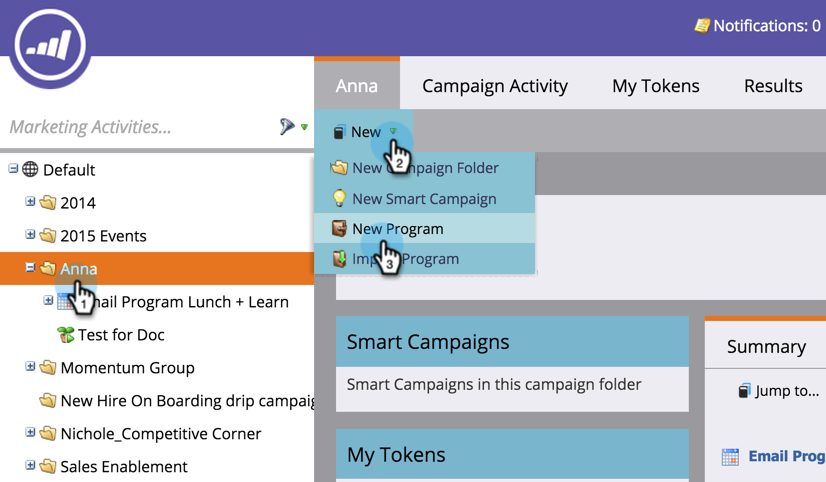
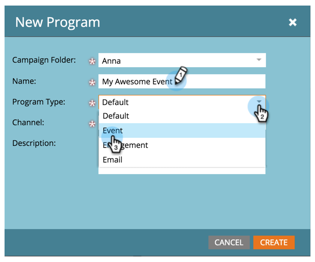
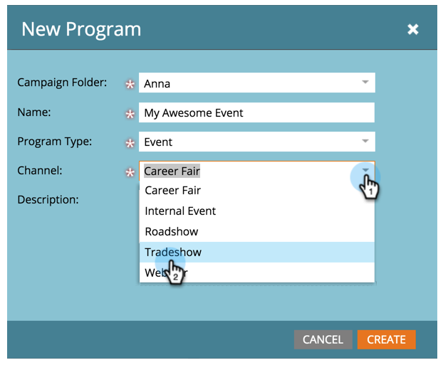
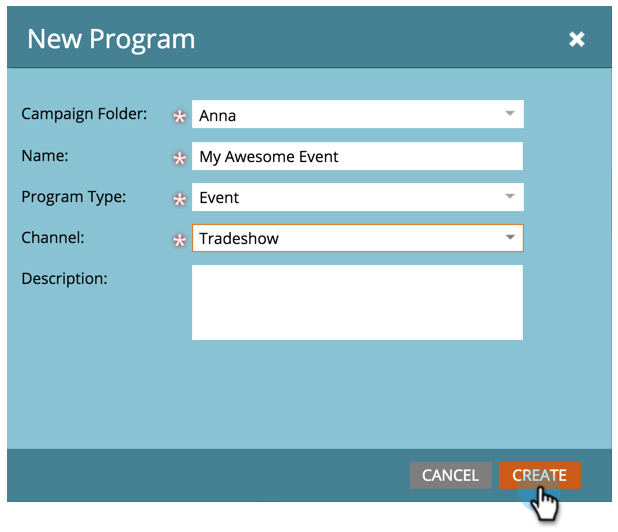
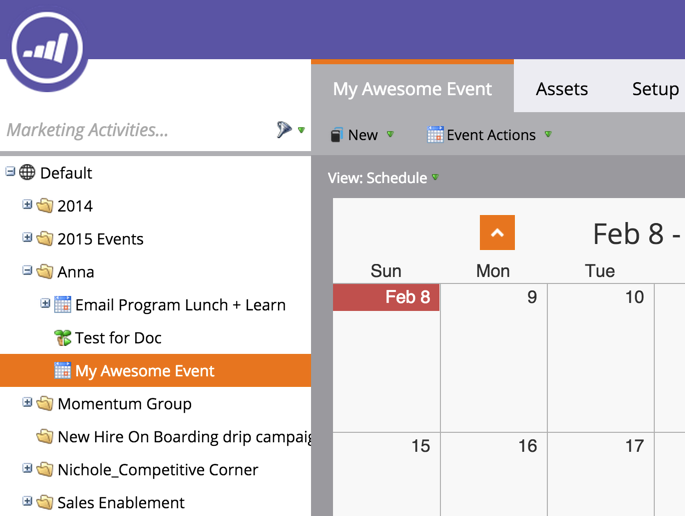
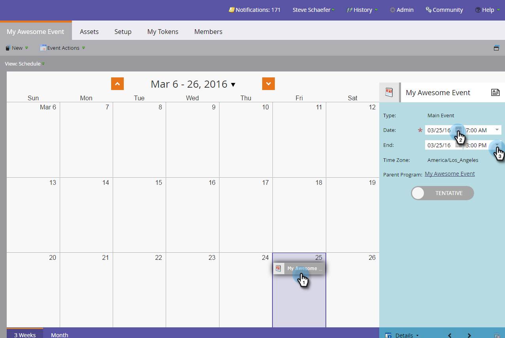

# Create a New Event Program {#create-a-new-event-program}

Events allow you to automate online and offline events! Capture the status of your people as they progress through different stages and get accurate measures of the ROI for your marketing initiatives.

1. Go to **Marketing Activities**. 

   

1. Select the folder for the new program. Select **New** and click **New Program**.

   

1. Choose a name for your event. Then, under **Program Type**, select **Event**.

   

1. Select a **Channel. **

   >[!NOTE]
   >
   >Channels define the different statuses a person can have in a program. Learn more about [program membership](../../../../product-docs/core-marketo-concepts/programs/creating-programs/understanding-program-membership.md) here.

   

1. Click **Create**.

    

1. To schedule your event, select **Schedule View** and click it in the calendar to open the popup. Enter dates and times.

   

1. Slide the bar to **Confirmed** when you're done.

   

Ta-da! Your new event will now appear in the tree. Once your event is created, build the [landing pages](../../../../product-docs/demand-generation/landing-pages/free-form-landing-pages/create-a-free-form-landing-page.md), [forms](../../../../product-docs/demand-generation/forms/creating-a-form/create-a-form.md), and [emails](../../../../product-docs/email-marketing/email-programs/creating-an-email-program/create-an-email-program.md) to invite your guests! You'll also want to get familiar with the [program schedule view](http://docs.marketo.com/display/docs/program+schedule+view).

>[!MORELIKETHIS]
>
>* [Marketing Calendar](http://docs.marketo.com/display/docs/marketing+calendar)
>* [Using Period Costs in a Program](../../../../product-docs/core-marketo-concepts/programs/working-with-programs/using-period-costs-in-a-program.md)
>

