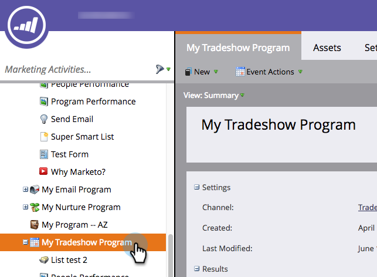
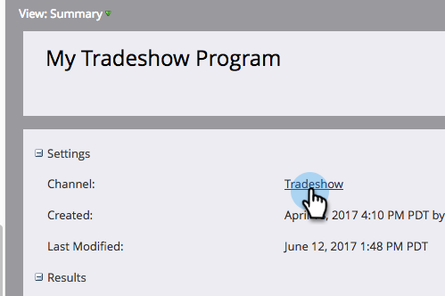
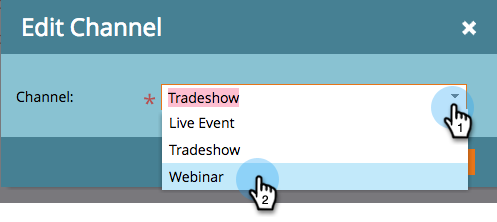

# Edit an Event Channel {#edit-an-event-channel}

You can edit the channel type from the event’s **Summary** tab or from its **Setup** tab.

>[!NOTE]
>
>This option is only available for events that do not have associated members. Once an event has members, you cannot change the channel type.

##

>[!NOTE]
>
>A program is one specific marketing initiative. The&nbsp;**channel**&nbsp;is intended to be the delivery mechanism, like Webinar, Tradeshow, or Online Ad. You may see different channel options in your drop-down, depending on what's available in your own instance. You can also&nbsp; [create your own channel.](http://docs.marketo.com/display/DOCS/Create+a+Program+Channel)

## From the Summary Tab {#from-the-summary-tab}

1. From **Marketing Activities**, select your event from the tree.

   

1. Navigate to the **Summary** view.

   

1. Under the **Settings** category, select the current **Channel** displayed as a hyperlink.

   

1. From the drop-down list, select a new channel.

   

1. Click **Save**.

   

## From the Setup Tab {#from-the-setup-tab}

A new channel type can also be assigned from the event’s **Setup** tab.

1. Select your event from the tree.

   

1. Navigate to the **Setup** tab. Double-click the current **Channel**.

   

1. Select a new **Channel**.

   

1. Click **Save.**

   

Congrats! You've just edited a channel!
