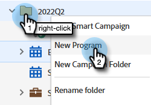
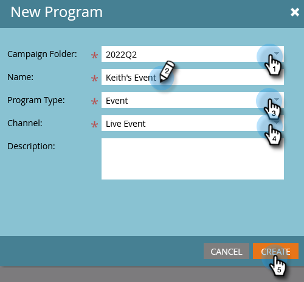
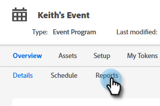
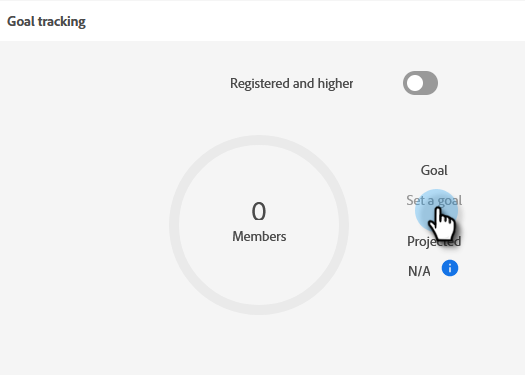
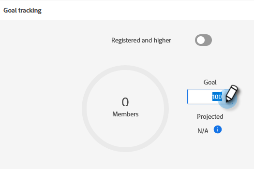
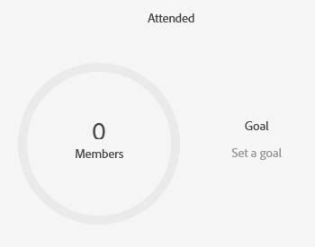

# Setting Event Goals {#setting-event-goals}

Give your events specific goals and see how they perform.

>[!IMPORTANT]
>
>Not everyone has purchased this feature. Please contact the Adobe Account Team (your Account Manager) for details.

1. Create an event program.

   

1. Choose the [!UICONTROL Campaign Folder], give your event a [!UICONTROL Name], select the [!UICONTROL Program Type] and [!UICONTROL Channel]. Click **[!UICONTROL Create]** when done.

   

1. In your event, click the **[!UICONTROL Reports]** tab.

   

1. Enter the goal for [!UICONTROL Registered] by clicking **[!UICONTROL Set a goal]**. Type the number in and hit enter.

   

   

1. Repeat the same steps for [!UICONTROL Attended].

   

>[!NOTE]
>
>You can't set goals for an event after it started.

And that's it! Check your event goal status by clicking on the [!UICONTROL Reports] tab.
