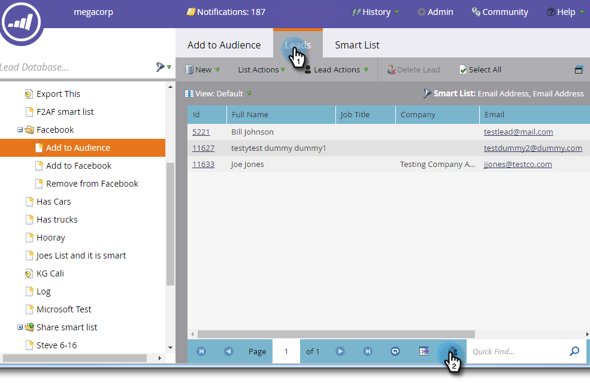
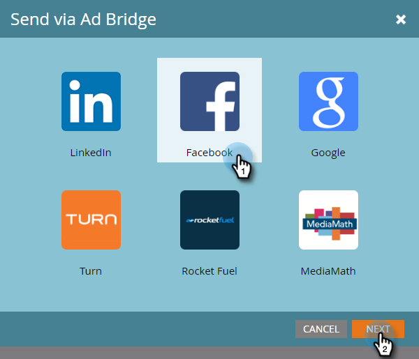
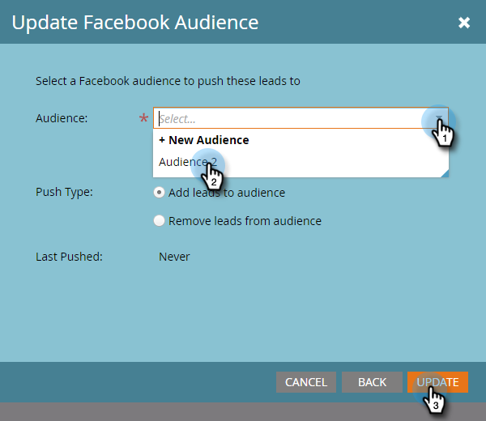

# Add Leads to a Custom Audience in Facebook {#add-leads-to-a-custom-audience-in-facebook}

Already have a custom audience in Facebook and want to add more leads to it? Here's how.

>[!PREREQUISITES]
>
>* [Create a Custom Audience in Facebook](/help/marketo/product-docs/demand-generation/facebook/create-a-custom-audience-in-facebook.md)
>* [Accept Facebook's custom audiences terms](https://www.facebook.com/ads/manage/customaudiences/tos.php) within your Facebook account.
>

1. Find and select the smart or static list that contains the leads you want to add.

   

1. Select the **Leads** tab, then click on the **Send Via Ad Bridge** icon at the bottom.

   

1. Select **Facebook** and click **Next**.

   

1. Click the **Audience** drop-down, select the audience you want to add the leads to, and click **Update**.

   

   >[!NOTE]
   >
   >**Add leads to audience**: only Facebook audiences with a custom sub-type will be available.  
   >**Remove leads from audience**: removes the leads in your static or smart list from a Facebook audience.

1. When done, the status will update.

   

   That's all there is to it!

   >[!NOTE]
   >
   >[Create a Custom Audience in Facebook](/help/marketo/product-docs/demand-generation/facebook/create-a-custom-audience-in-facebook.md)
