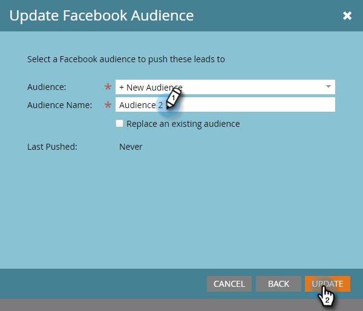
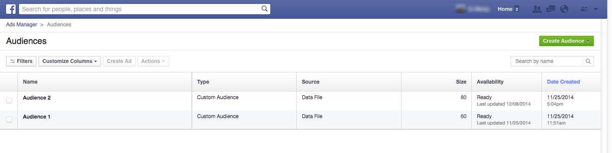

# Create a Custom Audience in Facebook {#create-a-custom-audience-in-facebook}

Create a Custom Audience in Facebook - Marketo Docs - Product Documentation

>[!NOTE]
>
>**Prerequisites**
>
>* [Add Facebook Custom Audiences as a LaunchPoint Service](../../../product-docs/demand-generation/ad-network-integrations/add-facebook-custom-audiences-as-a-launchpoint-service.md) in the Admin section.
>* [Accept Facebook's Custom Audiences Terms](https://www.facebook.com/ads/manage/customaudiences/tos.php) within your Facebook account.
>

>[!TIP]
>
>Learn more about [custom audiences in Facebook](https://www.facebook.com/help/341425252616329).

1. Find and select the smart or static list that contains the leads you want to create the audience from.

   

1. Select the **Leads** tab, then click on the **Send Via Ad Bridge **icon at the bottom.

   

1. Select **Facebook **and click **Next**.

   

1. Click the **Audience** drop-down and select **+ New Audience**.

   

1. Type in an **Audience Name**. Click **Update**.

   

   >[!NOTE]
   >
   >If you have multiple Facebook Ad Accounts, you will see an additional drop-down, allowing you to choose which Ad Account this audience is created in.

   >[!TIP]
   >
   >Want to swap a new audience with an existing one that's currently associated with an ad set or group? Select the **Replace an existing audience** check box. Doing this will **not** delete the audience being replaced.

1. When done, the status dialog will update.

   

   And that's it! In Facebook you'll see the new audience in **Ads Manager > Audiences**.

   

   >[!NOTE]
   >
   >All lists that you push over to Facebook become static. Smart lists in Marketo will not auto-update the audience list in Facebook to reflect any changes made after the transfer.

   >[!TIP]
   >
   >See the [Facebook learning path for Marketo customers](https://facebook.exceedlms.com/student/enrollments/create_enrollment_from_token/BF9TqSaCvM73PP4ScjhCm4fi). It covers everything you need to know, from creating a Facebook page to targeting your Facebook ads using Marketo's ad network integrations.

   >[!NOTE]
   >
   >**Related Articles**
   >
   >    
   >    
   >    * [Add Leads to a Custom Audience in Facebook](add-leads-to-a-custom-audience-in-facebook.md)
   >    
   >

