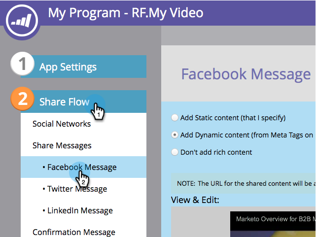
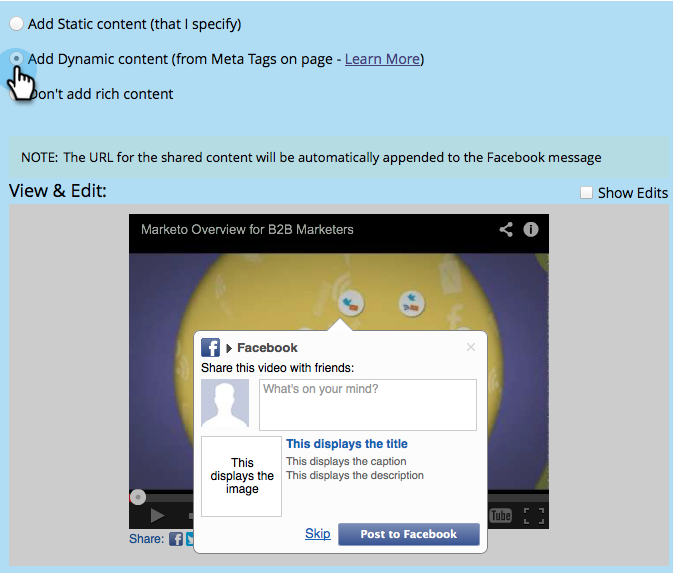
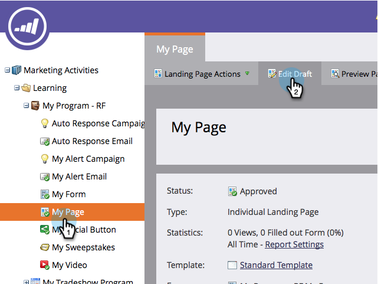
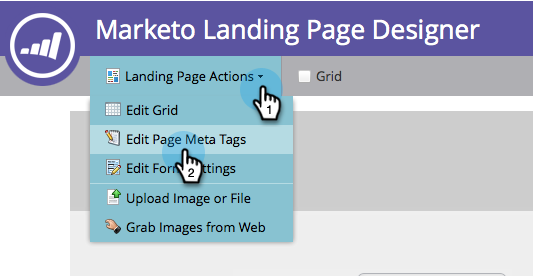
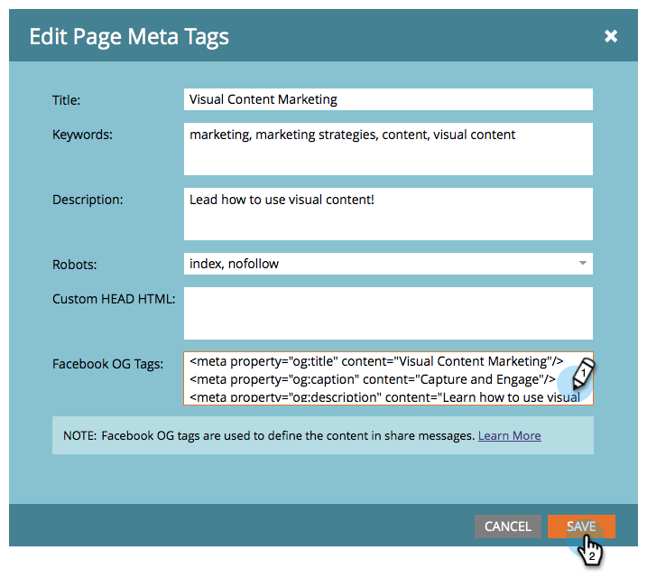

# Edit Facebook Rich Post Settings {#edit-facebook-rich-post-settings}

Customize posts when people [share you](http://docs.marketo.com/display/docs/social) on Facebook.

>[!NOTE]
>
>**Availability**
>
>Not all customers have purchased this functionality. Contact your sales rep for details.

Marketo [social apps](http://docs.marketo.com/display/docs/social) allow your leads to share your landing pages with their connections on social networks such as Facebook, Twitter, etc. Facebook OpenGraph tags (OG tags) allow you to specify which information from your landing page is included in Facebook posts.

## Select Rich Post Options {#select-rich-post-options}

You can specify the types of page information to use in the Facebook rich posts generated by shares from your landing page.

1. Select **Facebook Message** in the editor for your **YouTube** video or social button. 

   

1. Select from the following options for your Facebook Message.

    * Add Static Content: Select this option to enter the title, caption, and description manually.  
      

    * Add Dynamic Content: Your social app can use your landing page's <TITLE>, <CAPTION>, and <DESCRIPTION> tags to populate your rich post.  
      

   >[!NOTE]
   >
   >These should already exist in the page source, but for more control, you can&nbsp; [add specific Facebook OG tags to your landing page](edit-facebook-rich-post-settings.md).&nbsp;

    * Don't add rich content: Limits the Facebook posts from your landing page to just the main message and link.  
      

## Add Facebook OG Tags to a Landing Page {#add-facebook-og-tags-to-a-landing-page}

To control the page elements that will be included in the Facebook shares from your landing page, you can add Facebook OG (Open Graph) tags for title, caption, and description to your landing page.

1. Open the landing page that contains your **YouTube video** or social button. 

   

   The **Landing Page Designer** opens in a new window.

1. Select **Landing Page Actions** > **Edit Page Meta Tags****.** 

   

1. Add the HTML that defines og:title, og:caption, and og:description. Copy and paste these lines and replace the placeholder text:

   <meta property="og:title" content="My Post Title"/>  
   <meta property="og:caption" content="My Post Caption"/>  
   <meta property="og:description" content="This text appears in the post description"/>

   

>[!NOTE]
>
>Be careful to use the proper HTML syntax when adding the OG tags.

