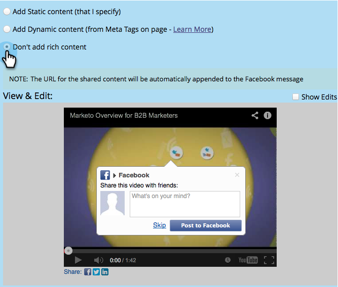

# Edit [!DNL Facebook] Rich Post Settings {#edit-facebook-rich-post-settings}

Customize posts when people share you on [!DNL Facebook].

>[!AVAILABILITY]
>
>Not all customers have purchased this functionality. Contact your sales rep for details.

Marketo [social apps](/help/marketo/product-docs/demand-generation/social/social-functions/add-a-social-button-on-a-landing-page.md) allow your leads to share your landing pages with their connections on social networks such as [!DNL Facebook], Twitter, etc. [!DNL Facebook] OpenGraph tags (OG tags) allow you to specify which information from your landing page is included in [!DNL Facebook] posts.

## Select Rich Post Options {#select-rich-post-options}

You can specify the types of page information to use in the [!DNL Facebook] rich posts generated by shares from your landing page.

1. Select **[!UICONTROL Facebook Message]** in the editor for your **[!DNL YouTube*]* video or social button.

   

1. Select from the following options for your [!DNL Facebook] Message.

    * Add Static Content: Select this option to enter the title, caption, and description manually.

   

    * Add Dynamic Content: Your social app can use your landing page's `<TITLE>`, `<CAPTION>`, and `<DESCRIPTION>` tags to populate your rich post.  

   

   >[!NOTE]
   >
   >These should already exist in the page source, but for more control, you can add specific [!DNL Facebook] OG tags to your landing page.

    * Don't add rich content: Limits the [!DNL Facebook] posts from your landing page to just the main message and link.

   

## Add [!DNL Facebook] OG Tags to a Landing Page {#add-facebook-og-tags-to-a-landing-page}

To control the page elements that will be included in the [!DNL Facebook] shares from your landing page, you can add [!DNL Facebook] OG (Open Graph) tags for title, caption, and description to your landing page.

1. Open the landing page that contains your **[!DNL YouTube ]video** or social button.

   

   The **[!UICONTROL Landing Page Designer]** opens in a new window.

1. Select **[!UICONTROL Landing Page Actions]** > **[!UICONTROL Edit Page Meta Tags]**.

   

1. Add the HTML that defines og:title, og:caption, and og:description. Copy and paste these lines and replace the placeholder text:

   `<meta property="og:title" content="My Post Title"/>`

   `<meta property="og:caption" content="My Post Caption"/>`

   `<meta property="og:description" content="This text appears in the post description"/>`

   

>[!NOTE]
>
>Be careful to use the proper HTML syntax when adding the OG tags.
