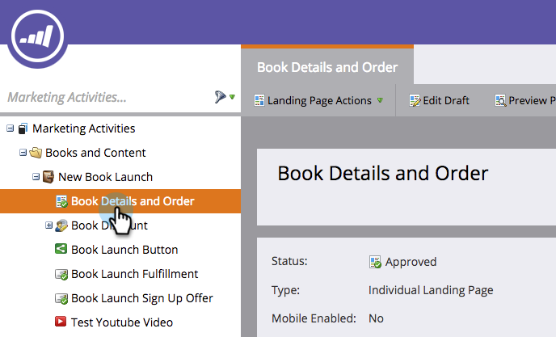
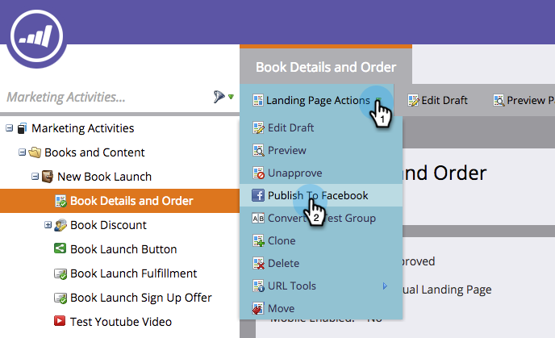
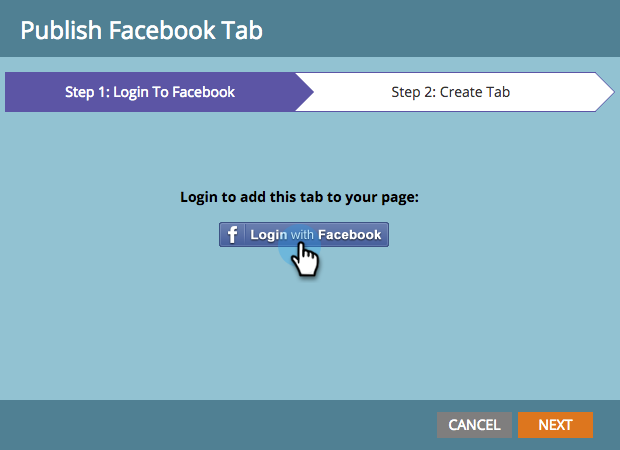
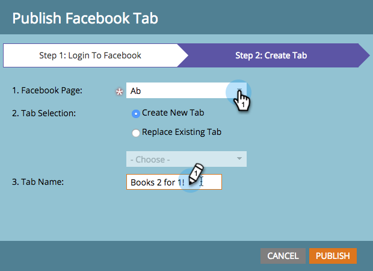
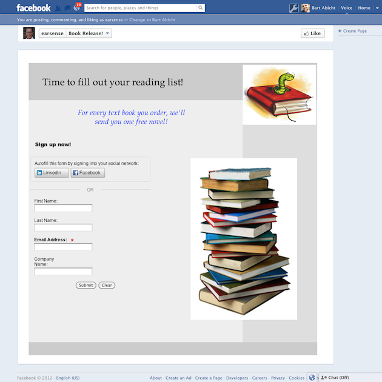

# Publish Landing Pages to Facebook {#publish-landing-pages-to-facebook}

You can publish your landing pages to Facebook, meeting your audience where they already hang out and generating more traffic to your programs.

>[!NOTE]
>
>**Availability**
>
>SMB Spark, Standard & Select. Enterprise with separately licensed feature.

>[!NOTE]
>
>**Prerequisites**
>
>Your page must have at least 2,000 likes before you're able to publish to Facebook.

Say you're launching a new book, you might reach some of your audience via email and web site. Publishing a Marketo landing page additionally to your Facebook Brand Page reaches a larger audience and encourages sharing of your offer.

1. Select an approved landing page.

   

1. Select **Publish to Facebook** from Landing Page Actions.

   

   >[!NOTE]
   >
   >This technique publishes your landing page to a Facebook App (formerly known as Facebook Tab). Since Facebook Apps are not available on mobile, this technique will not work when the visitor tries to access your landing page published to a Facebook App on a mobile device.

1. Authorize Marketo to publish to your Facebook page.

   

1. Enter your Facebook credentials.

   

   >[!NOTE]
   >
   >You will need to use an account that has admin permissions for the Facebook Page you want to publish your Marketo landing page on.

1. Select the **Facebook Page** where you wish to publish the landing page and enter the name by which your Marketo landing page should appear there.

   

   >[!NOTE]
   >
   >To replace Marketo landing pages that you have previously published to Facebook, select **Replace Existing Tab** and choose the tab to replace from the drop-down list. Note that this will not replace non-Marketo tabs.

1. Leads can now visit your landing page directly on your Facebook Page. Just click the tab name under your Cover image.

   

   >[!NOTE]
   >
   >**Reminder**
   >
   >
   >To remove the landing page from Facebook, unapprove it in Marketo and, when prompted, select the option to remove the Facebook tab.

