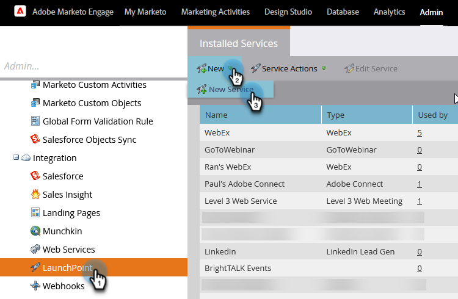
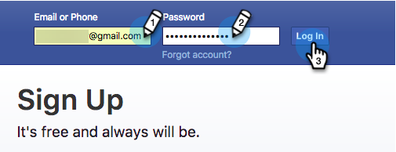
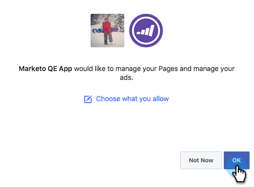
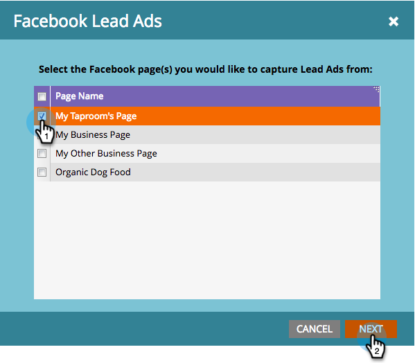
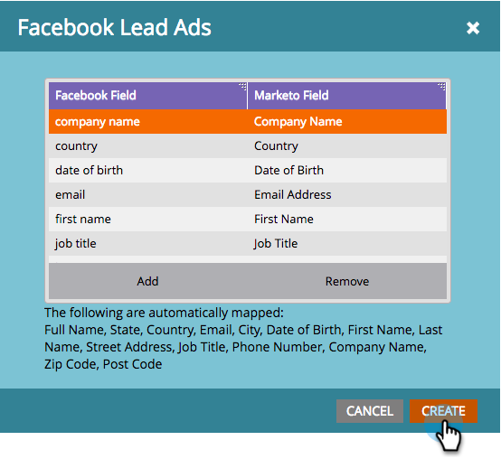
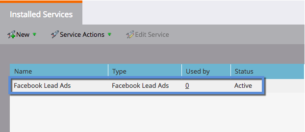

# Set up Facebook Lead Ads {#set-up-facebook-lead-ads}

Use [Facebook Lead Ads](https://www.facebook.com/business/ads/ad-objectives/lead-generation){target="_blank"} to run ad campaigns in Facebook and generate leads for Marketo.

>[!NOTE]
>
>**Admin Permissions Required**

>[!AVAILABILITY]
>
>To get Facebook Lead Ads added to your instance, please contact the Adobe Account Team (your Account Manager).

1. In Marketo Engage, go to the **Admin** area.

   

1. Go to **LaunchPoint**, click the **New** drop-down and select **New Service**.

   

1. Enter a **[!UICONTROL Display Name]** for your service, select the **[!UICONTROL Facebook Lead Ads]** service from the drop-down, and click **[!UICONTROL Create]**.

   

1. Open a new tab in the same browser and go to [facebook.com](https://www.facebook.com){target="_blank"}. Log in to Facebook using the account you want to use for the integration.

   >[!NOTE]
   >
   >The [!DNL Facebook] account will need access to all the [!DNL Facebook] business pages you want to pull lead ads from.

   

1. After you're logged into [!DNL Facebook], return to Marketo and click **[!UICONTROL Authorize]**.

   

1. If prompted, click **[!UICONTROL OK]** to accept the Marketo app installation into [!DNL Facebook].

   

1. You'll notice you are now authorized. Click **[!UICONTROL Next]**.

   

1. Select the page(s) you want Marketo to pull [!UICONTROL Facebook Lead Ads] from and click **[!UICONTROL Next]**.

   >[!TIP]
   >
   >If you don't see a page you're expecting, ensure that the [!DNL Facebook] account used to authenticate is added to the page on [!DNL Facebook] and try again.

   

1. To accept default [!DNL Facebook] to Marketo field mappings, simply click **[!UICONTROL Create]**.

   >[!TIP]
   >
   >By modifying the mappings, you can customize where the lead ads data is stored in Marketo. You can also [pull in data from Lead Ads Custom Questions](/help/marketo/product-docs/demand-generation/facebook/set-up-facebook-lead-ads/map-custom-fields-to-marketo.md){target="_blank"}.

   >[!CAUTION]
   >
   >Marketo doesn't support mapping two [!DNL Facebook] fields to a single Marketo field, only 1 to 1. If you map 2 to 1, leads may fail to enter the Marketo system.

   

   Nicely done! Leads will start flowing into Marketo as you run successful [!DNL Facebook] Lead Ad campaigns.

   

>[!MORELIKETHIS]
>
>* [Assign/Remove Permissions in Leads Access Manager (Facebook)](https://www.facebook.com/business/help/540596413257598?id=735435806665862){target="_blank"}
>* [Use Lead Ads Filters and Triggers in a Smart Campaign](/help/marketo/product-docs/demand-generation/facebook/use-lead-ads-filters-and-triggers-in-a-smart-campaign.md){target="_blank"}
>* [Map Custom Fields to Marketo](/help/marketo/product-docs/demand-generation/facebook/set-up-facebook-lead-ads/map-custom-fields-to-marketo.md){target="_blank"}
