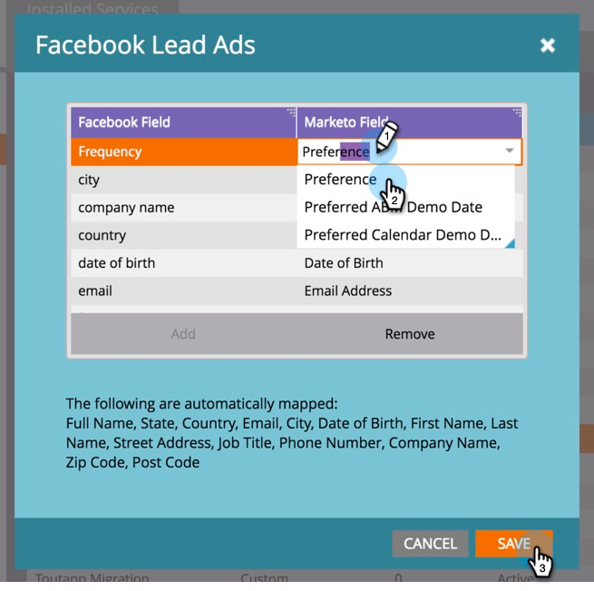

# Map Custom Fields to Marketo {#map-custom-fields-to-marketo}

You may want to collect more than the standard information [!DNL Facebook] stores by default, such as how often someone uses your online delivery service. You can accomplish this by [creating custom questions](https://www.facebook.com/business/help/774623835981457?helpref=uf_permalink) in your [!DNL Facebook] lead ads.

However, **Marketo will not automatically start gathering this data**. In order for Marketo to start capturing custom field values, you **must** map those custom fields to a field in Marketo.

Follow these steps to set this up in the LaunchPoint area of Admin.

>[!NOTE]
>
>**Admin Permissions Required**

1. Go to the Admin area and click **[!UICONTROL LaunchPoint]**. Under Installed Services, find and edit **[!UICONTROL Facebook Lead Ads]**.

   

1. Click **[!UICONTROL Next]**.

   

1. Leave the authorized account as is, do **not** make any changes. Click **[!UICONTROL Next]**.

   

1. As before, leave the selected pages as is, do **not** make any changes. Click **[!UICONTROL Next]**.

   

1. Map the custom [!DNL Facebook] field to your Marketo field. Click **[!UICONTROL Add].**

   

1. In the new row, enter the name of your [!DNL Facebook] custom field.

   

   >[!NOTE]
   >
   >Only fields that have been saved to [!DNL Facebook] form templates will appear as options here.

1. Click in the **[!UICONTROL Marketo Field]** column. Type to search for the field you want to map to. After you have selected a field, click **[!UICONTROL Save]**.

   

   >[!NOTE]
   >
   >If you don't already have a field in Marketo to map the [!DNL Facebook] field to, learn how to [create custom fields](/help/marketo/product-docs/administration/field-management/create-a-custom-field-in-marketo.md).

>[!CAUTION]
>
>You **must** go through this process for any new [!DNL Facebook] field in order for Marketo to gather the data.
