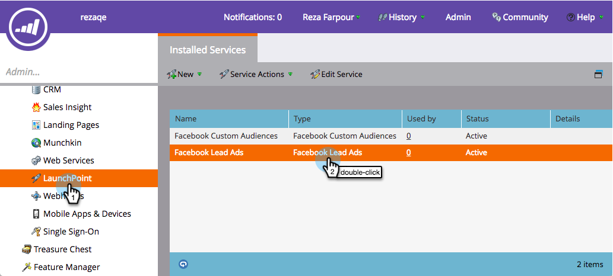
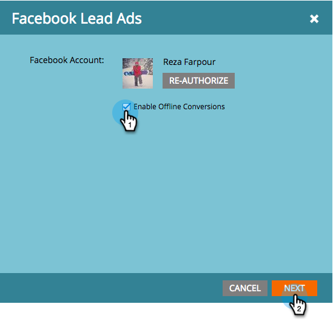
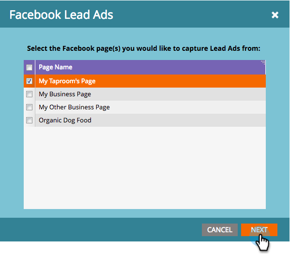
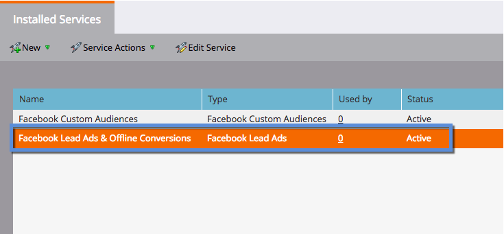
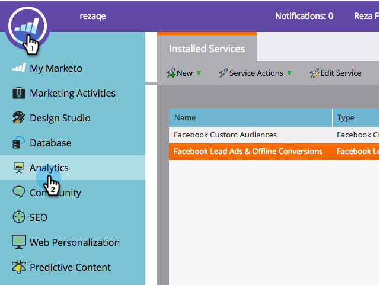
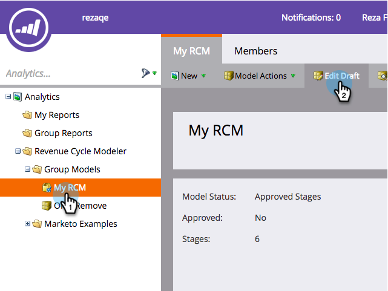
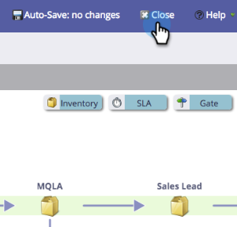
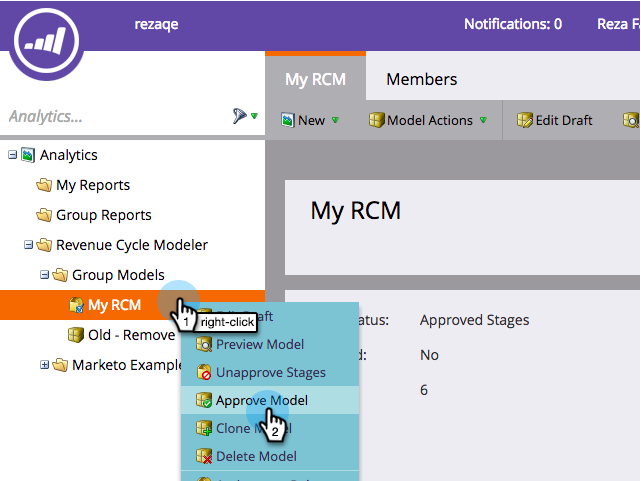

# Set Up Facebook Offline Conversions {#set-up-facebook-offline-conversions}

By sending offline conversion data back to Facebook for people created via Lead Ads, your advertising team can optimize their ad spend better than ever. Here's how to set it up.

>[!PREREQUISITES]
>
>* You must [set up Facebook Lead Ads](set-up-facebook-lead-ads.md).
>* You must have an approved model in [Revenue Cycle Modeler](http://docs.marketo.com/display/docs/revenue+cycle+models).
>

## Admin Configuration {#admin-configuration}

1. Go to Marketo **Admin**.

   

1. Go to **LaunchPoint** and double-click the Facebook Lead Ads service you created previously.

   >[!NOTE]
   >
   >If you haven't done that, go ahead and [Set Up Facebook Lead Ads](set-up-facebook-lead-ads.md), then come back here.

   

1. If you like, edit the **Display Name** to include Offline Conversions. Click **Next**.

   

1. Check **Enable Offline Conversions** and click **Next**.

   

1. Click **Next**.

   

1. Click **Save**.

   

   Sweet! You're halfway done enabling Facebook Offline Conversions. Let's hop over to the Revenue Cycle Modeler to map the stages.

   

## Revenue Cycle Modeler Configuration {#revenue-cycle-modeler-configuration}

1. Go to **Analytics**.

   

1. Select your model and click **Edit Draft**.

   

   >[!NOTE]
   >
   >Currently, there are 10 Facebook events you can map Revenue Cycle Stages to:
   >
   >    
   >    
   >    * Adds of Payment Info
   >    * Adds to Cart
   >    * Adds to Wish List
   >    * Registrations Completed
   >    * Checkouts Initiated
   >    * Person
   >    * Other
   >    * Purchase
   >    * Searches
   >    * Content Views
   >    
   >

1. Select the stage you want to map, then from the **Facebook Conversion** drop-down, select the Facebook Event you want to map it to. Repeat this step to map all the stages in your RCM to offline conversion stages on Facebook.

   

1. When you're done mapping, close the model.

   

1. Approve your model and you're done!

   

   Now, when Lead Ad leads reach the stages you mapped, the conversions are sent over to Facebook for reporting.

   >[!CAUTION]
   >
   >Check your Facebook account and ensure that all [ads are associated](https://www.facebook.com/business/url/?href=%2Fbusiness%2Fhelp%2Fwww%2F1776828022605281&cmsid&creative=link&creative_detail=advertiser-help-center&create_type&destination_cms_id&orig_http_referrer) to the Marketo Offline Conversions Event Set. If they're not, ad attribution may not work.

   >[!NOTE]
   >
   >Offline Conversion Data is sent from Marketo to Facebook several times daily.

>[!NOTE]
>
>**Related Articles**
>
>* [Understanding Facebook Offline Conversions](understanding-facebook-offline-conversions.md)
>

