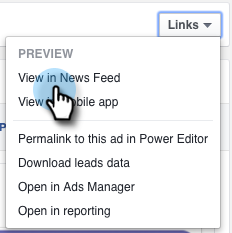
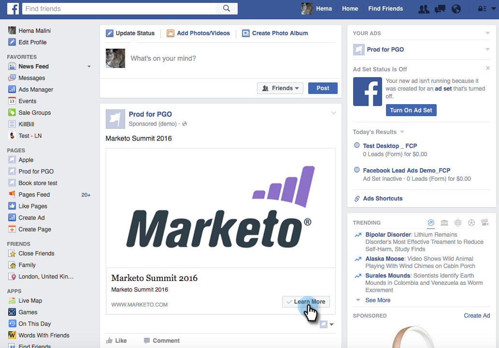
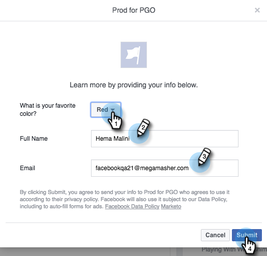
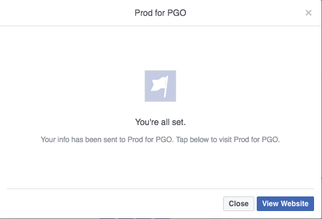

# Test Facebook Lead Ads for Desktop Integration with Marketo {#test-facebook-lead-ads-for-desktop-integration-with-marketo}

After you create your Lead Ad, you should test it! Here's how to do it on your desktop.

>[!PREREQUISITES]
>
>You must [Set up the Facebook Lead Ads Integration](/help/marketo/product-docs/demand-generation/facebook/set-up-facebook-lead-ads.md).

1. In the Facebook Power Editor, select a campaign, an ad, and click **Edit**.

1. Under **Links**, click the **View in News Feed** link.

   

1. You'll be directed to Facebook in a new tab in your browser. Click the Call to Action in the Facebook Lead Ad unit.

   

   >[!NOTE]
   >
   >This is just an example, which uses a Learn More Call To Action. Your Lead Ad unit Call To Action might be different.

1. Submit your test Lead Ad unit by filling out the form on your desktop. Click **Submit**.

   

1. Congratulations. You're done with submitting the Lead Ad form.

   

1. This is where the magic happens! Once you've submitted your form, [build a smart list in Marketo](/help/marketo/product-docs/core-marketo-concepts/smart-lists-and-static-lists/creating-a-smart-list/create-a-smart-list.md) as part of a program or in the database that uses the Filled Out Facebook Lead Ads Form filter. Insert the Lead Ad Form Name of the form you just submitted.

   

1. Now click the **People** tab to validate that the sync is working correctly.

   

   Is that cool or what?

>[!MORELIKETHIS]
>
>[Set Up Facebook Lead Ads](/help/marketo/product-docs/demand-generation/facebook/set-up-facebook-lead-ads.md)
