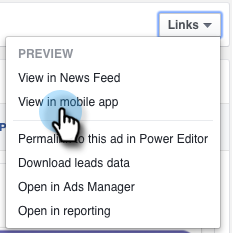
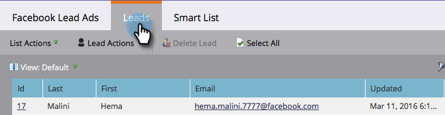

# Test Facebook Lead Ads for Mobile Integration with Marketo {#test-facebook-lead-ads-for-mobile-integration-with-marketo}

After you create your Lead Ad, you should test it!

>[!PREREQUISITES]
>
>You must [Set up the Facebook Lead Ads Integration](/help/marketo/product-docs/demand-generation/facebook/set-up-facebook-lead-ads.md).

1. In the Facebook Power Editor, select a campaign, an ad, and click **Edit**.

1. Under **Links**, click the **View on mobile app** link.

   

1. A new notification will be sent to the Facebook account that you can access on the mobile device with the authorized account. Click **OK**.

   

1. On your mobile device, tap **Notifications** in the Facebook mobile app.

   

1. In Notifications, tap **Your ad is ready to preview**.

   

1. Submit your test Lead Ad unit by tapping your Call To Action and filling out the form you created.

   

   >[!NOTE]
   >
   >This is just an example, which uses a Learn More Call To Action. Your Lead Ad unit Call To Action might be different.

1. This is where the magic happens! Once you have submitted your form, [build a smart list in Marketo](/help/marketo/product-docs/core-marketo-concepts/smart-lists-and-static-lists/creating-a-smart-list/create-a-smart-list.md) as part of a program or in the lead database that uses the **Filled Out Facebook Lead Ads Form** filter. Insert the Lead Ad Form Name of the form you just submitted.

   

1. Now click the Leads tab to validate that the sync is working correctly.

   

 Is that cool or what?

>[!NOTE]
>
>[Enable/Disable Facebook Lead Ads](/help/marketo/product-docs/demand-generation/facebook/set-up-facebook-lead-ads.md)
