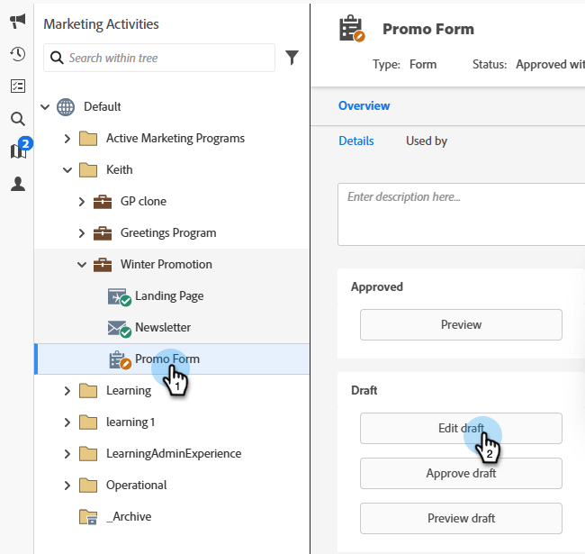
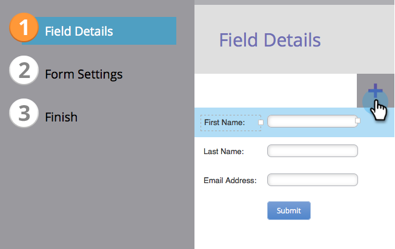
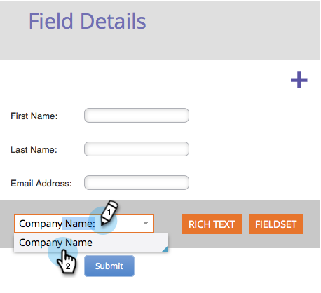
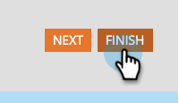
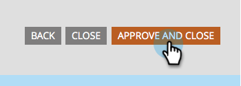

# Add a Field to a Form {#add-a-field-to-a-form}

Once you've [created your form](/help/marketo/product-docs/demand-generation/forms/creating-a-form/create-a-form.md){target="_blank"} and [selected a theme](/help/marketo/product-docs/demand-generation/forms/creating-a-form/select-a-form-theme.md){target="_blank"}, you may want to add additional fields for people to fill out. Here's how.

1. Go to **[!UICONTROL Marketing Activities]**.

   

1. Select your form and click **[!UICONTROL Edit Draft]**

   

   >[!NOTE]
   >
   >If the desired form is in the _Approved_ state, you must first click **Create Draft**.

1. In the form, click the **+** sign.

   

   >[!NOTE]
   >
   >When you create a new form, [!UICONTROL First Name], [!UICONTROL Last Name], and [!UICONTROL Email Address] are automatically added.

1. Find and select the field you want to add to your form.

   

1. Add as many fields as you need and click **[!UICONTROL Finish]**.

   

1. Click **[!UICONTROL Approve and Close]**.

   

>[!NOTE]
>
>Be sure to approve any landing page drafts created due to the form changes.

>[!MORELIKETHIS]
>
>[Make a form field required](/help/marketo/product-docs/demand-generation/forms/creating-a-form/make-a-form-field-required.md){target="_blank"}
