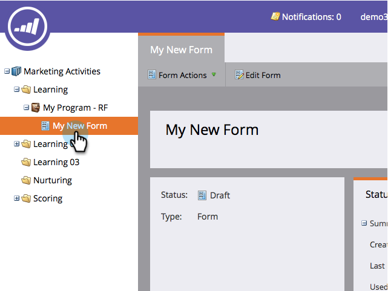
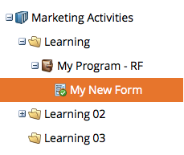
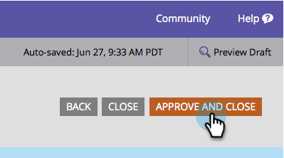

# Approve a Form {#approve-a-form}

In order to add a form to one of your landing pages, it must be approved. Here's how to do it.

## Approve a Form {#approve-a-form-1}

Here's how to approve an existing form that's ready to go.

1. Go to **Marketing Activities**.

   

1. Find and select your form.

   

1. Under **Form Actions**, click **Approve**.

   

1. Notice the green checkmark?

   

   It's approved and ready to be [added to a landing page](/help/marketo/product-docs/demand-generation/landing-pages/understanding-landing-pages/approve-unapprove-or-delete-a-landing-page.md).

   >[!NOTE]
   >
   >Changes made after approval can take up to four minutes to update on embedded forms.

## Approve a Form from the Editor {#approve-a-form-from-the-editor}

If you are making changes to a form, you can approve the page directly from the editor.

>[!PREREQUISITES]
>
>* [Edit a Form](/help/marketo/product-docs/demand-generation/forms/form-actions/edit-a-form.md)

1. Click **Finish**.

   

1. Click **Approve and Close**.

   

>[!NOTE]
>
>Remember, if you edit the form after it's approved, you will need to [approve the landing page](/help/marketo/product-docs/demand-generation/landing-pages/understanding-landing-pages/approve-unapprove-or-delete-a-landing-page.md) to see the changes.

That's it! Easy as can be.
