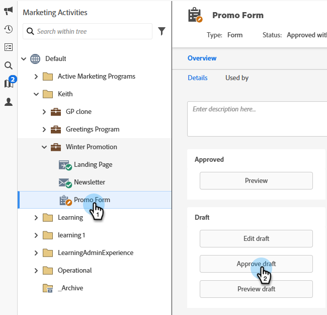
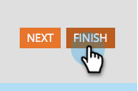
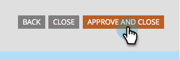

# Approve a Form {#approve-a-form}

In order to add a form to one of your Landing Pages, it must be approved.

## Approve a Form {#approve}

Here's how to approve an existing form that's ready to go.

1. Go to **[!UICONTROL Marketing Activities]**.

   

1. Select the desired form and click **[!UICONTROL Approve draft]**.

   

   A green checkmark appears.

   

   It's approved and ready to be [added to a Landing Page](/help/marketo/product-docs/demand-generation/landing-pages/understanding-landing-pages/approve-unapprove-or-delete-a-landing-page.md){target="_blank"}.

   >[!NOTE]
   >
   >Changes made after approval can take a few minutes to update on embedded forms.

## Approve a Form from the Editor {#approve-from-the-editor}

You can approve a form directly from the form editor.

>[!PREREQUISITES]
>
>[Edit a Form](/help/marketo/product-docs/demand-generation/forms/form-actions/edit-a-form.md)

1. In the form, click **[!UICONTROL Finish]**.

   

1. Click **[!UICONTROL Approve and Close]**.

   
