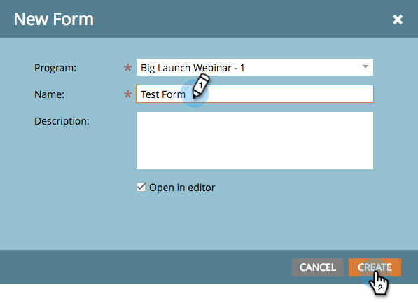

# Create a Form {#create-a-form}

Create and use a form on a landing page to generate new names. It's really easy - here's how to get started.

>[!NOTE]
>
>Learn what Marketo is doing to [keep your forms safe](https://nation.marketo.com/t5/Product-Documents/Forms-Service-Enhancements/ta-p/303670#M1038).

1. Go to **Marketing Activities**.

   

1. Find and select your **program**.

   

1. Under **New**, click **New** **Local** **Asset**.

   

1. Select **Form**.

   

1. Enter a form **Name** and click **Create**.

   

>[!TIP]
>
>Most customers create a new form for each landing page, but you can also create one form to be used with multiple landing pages. It's entirely up to you!

Sweet! Now that the form is created, let's go ahead and dress it up.

>[!MORELIKETHIS]
>
>* [Select a Form Theme](/help/marketo/product-docs/demand-generation/forms/creating-a-form/select-a-form-theme.md)
>* [Add a FieldSet to a Form](/help/marketo/product-docs/demand-generation/forms/form-fields/add-a-fieldset-to-a-form.md)
