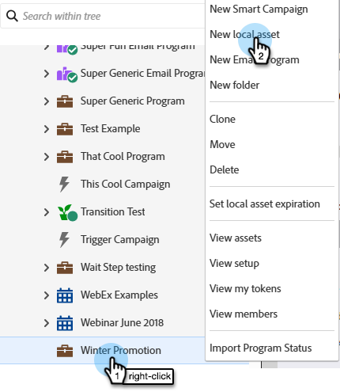
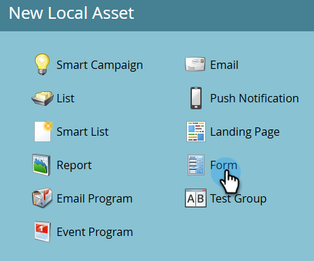

# Create a Form {#create-a-form}

Create and use a form on a Landing Page to generate new names or capture desired data.

>[!NOTE]
>
>Learn what Marketo Engage is doing to [keep your forms safe](https://nation.marketo.com/t5/Product-Documents/Forms-Service-Enhancements/ta-p/303670#M1038).

1. Go to **[!UICONTROL Marketing Activities]**.

   

1. Find the desired program. Right-click on it and select **[!UICONTROL New Local Asset]**.

   

1. Select **[!UICONTROL Form]**.

   

1. Enter a form **[!UICONTROL Name]** and click **[!UICONTROL Create]**.

   

>[!TIP]
>
>Most users create a new form for each Landing Page, but you can also create one form to be used with multiple Landing Pages. It's entirely up to you!

>[!MORELIKETHIS]
>
>* [Select a Form Theme](/help/marketo/product-docs/demand-generation/forms/creating-a-form/select-a-form-theme.md)
>* [Add a FieldSet to a Form](/help/marketo/product-docs/demand-generation/forms/form-fields/add-a-fieldset-to-a-form.md)
