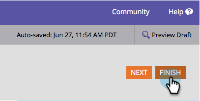
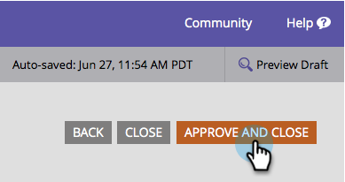

# Edit a Field Label in a Form {#edit-a-field-label-in-a-form}

You can change the label on a form to anything - you can even use an image or erase it completely! Here's how to do it.

1. Go to **Marketing Activities**.

   

1. Select your form and click **Edit Form**.

   

1. Select your field and then edit the **Label**. The fields in Form Settings will reflect the label(s) you've entered.

   

   >[!TIP]
   >
   >If you want to get fancy, you can click on the . This will open a rich text editor and allow you to go to town with images, links, and more!

1. Click **Finish**.

   

1. Click **Approve and Close**.

   

>[!NOTE]
>
>Don't forget to [approve the landing page draft](/help/marketo/product-docs/demand-generation/landing-pages/understanding-landing-pages/approve-unapprove-or-delete-a-landing-page.md) created by the form changes.

There you have it! Little by little you are becoming a form designer champion.
