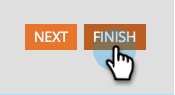
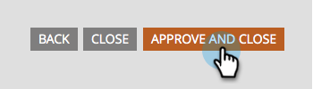

# Edit a Field Label in a Form {#edit-a-field-label-in-a-form}

You can change the label on a form to anything - you can even use an image or erase it completely! Here's how to do it.

1. Go to **[!UICONTROL Marketing Activities]**.

   

1. Select your form and click **[!UICONTROL Create draft]**.

   

   >[!NOTE]
   >
   >If your form isn't approved yet, click **Edit draft**.

1. Select your field and then edit the **[!UICONTROL Label]**. The fields in Form Settings will reflect the label(s) you've entered.

   

   >[!TIP]
   >
   >Click on the  icon to access the rich text editor.

1. Click **[!UICONTROL Finish]**.

   

1. Click **[!UICONTROL Approve and Close]**.

   

>[!NOTE]
>
>Don't forget to [approve the Landing Page draft](/help/marketo/product-docs/demand-generation/landing-pages/understanding-landing-pages/approve-unapprove-or-delete-a-landing-page.md){target="_blank"} created by the form changes.
