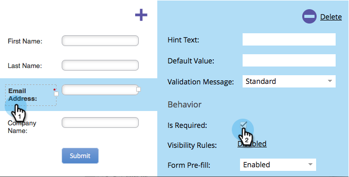
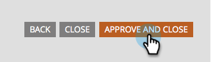

# Make a Form Field Required {#make-a-form-field-required}

When [adding fields to a form](/help/marketo/product-docs/demand-generation/forms/creating-a-form/add-a-field-to-a-form.md){target="_blank"}, you may want to make a few of them required to the person filling them out. Here's how.

1. Go to **[!UICONTROL Marketing Activities]**.

   

1. Select your form and click **[!UICONTROL Create draft]**.

   

   >[!NOTE]
   >
   >If your form isn't approved, click **Edit draft**.

1. Select the field you want to make required and check **[!UICONTROL Is Required]**.

   

1. Nicely done! Click **[!UICONTROL Finish]**.

   

1. Click **[!UICONTROL Approve and Close]**.

   

>[!NOTE]
>
>Don't forget to [approve any Landing Pages](/help/marketo/product-docs/demand-generation/landing-pages/understanding-landing-pages/approve-unapprove-or-delete-a-landing-page.md){target="_blank"} this form lives on for the changes to go live.

>[!MORELIKETHIS]
>
>[Reorder the fields you added to your form](/help/marketo/product-docs/demand-generation/forms/form-fields/reorder-fields-in-a-form.md){target="_blank"}
