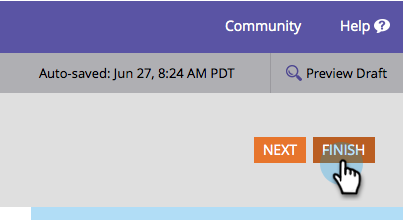

# Make a Form Field Required {#make-a-form-field-required}

When [adding fields to a form](/help/marketo/product-docs/demand-generation/forms/creating-a-form/add-a-field-to-a-form.md) you may want to make a few of them required to the person filling them out. Here's how.

1. Go to **Marketing Activities**.

   

1. Select your form and click **Edit Form**.

   

1. Select the field you want to make required and check Is Required.

   

1. Nicely done! Click **Finish**.

   

1. Click **Approve and Close**.

   

>[!NOTE]
>
>Don't forget to [approve any landing pages](/help/marketo/product-docs/demand-generation/landing-pages/understanding-landing-pages/approve-unapprove-or-delete-a-landing-page.md) this form lives on for the changes to go live.

Do you need to [reorder the fields you added to your form](/help/marketo/product-docs/demand-generation/forms/form-fields/reorder-fields-in-a-form.md)?
