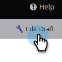

# Preview a Form {#preview-a-form}

Before you publish, you can see the form in this form previewer.

1. Go to **[!UICONTROL Marketing Activities]**.

   

1. Select your form and click **[!UICONTROL Preview]**.

   

   >[!NOTE]
   >
   >If your form is not approved, click **Preview draft**.

1. The form editor will open in _preview_ mode.

   

1. Click **[!UICONTROL Edit Draft]** to go back to _edit_ mode.

   

1. Switch back easily by clicking **[!UICONTROL Preview Draft]**.

   
