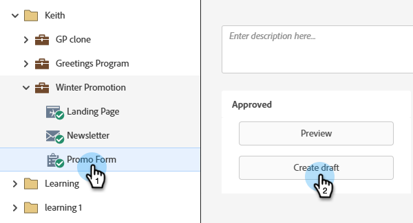
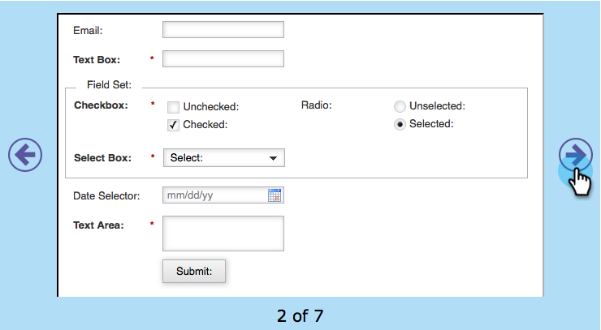
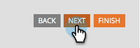

# Select a Form Theme {#select-a-form-theme}

We made a bunch of nice themes for your forms. Which do you like best?

1. Go to **[!UICONTROL Marketing Activities]**.

   

1. Select your form and click **[!UICONTROL Create draft]**.

   

   >[!NOTE]
   >
   >If your form isn't approved, click **Edit draft**.

1. Go to **[!UICONTROL Form Settings]**.

   

1. Toggle back and forth to choose the **[!UICONTROL Form Theme]** of your liking.

   

   Currently there are 7 built-in themes:

    * Simple
    * Inset
    * Glow
    * Round
    * Dark
    * Shadow
    * Plain

   >[!TIP]
   >
   >You can also [edit the CSS of your form theme](/help/marketo/product-docs/demand-generation/forms/form-design/edit-the-css-of-a-form-theme.md){target="_blank"}.

1. Click **[!UICONTROL Next]** to configure other form options, or click **[!UICONTROL Finish]** if you only wanted to change the Form Theme.

   

How easy was that?! You can let your HTML/CSS book collect some dust now.

>[!MORELIKETHIS]
>
>* [Edit the CSS of a Form Theme](/help/marketo/product-docs/demand-generation/forms/form-design/edit-the-css-of-a-form-theme.md){target="_blank"}
>* [Add a Field to a Form](/help/marketo/product-docs/demand-generation/forms/creating-a-form/add-a-field-to-a-form.md){target="_blank"}
