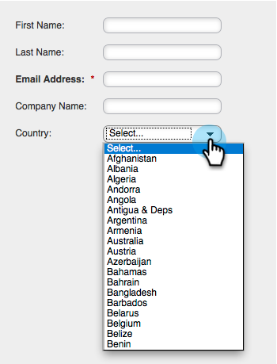

# Add a Country Picklist to your Form {#add-a-country-picklist-to-your-form}

Follow these instructions to convert the country field to a drop-down with a list of all the countries.

1. Go to **Marketing Activities**.

   

1. Select your form and click **Edit Form**.

   

1. Click the **+** sign.

   

1. Find and select **Country**.

   

1. With the **Country** field selected change the **Field Type** to **Select**.

   

1. **Edit** the **Values** to add the list of countries users can choose from.

   

1. Click **Advanced** **Editor**.

   

1. Select and copy this list of countries:

   ```
   Afghanistan Albania Algeria Andorra Angola Antigua & Deps Argentina Armenia Australia Austria Azerbaijan Bahamas Bahrain Bangladesh Barbados Belarus Belgium Belize Benin Bhutan Bolivia Bosnia Herzegovina Botswana Brazil Brunei Bulgaria Burkina Burundi Cambodia Cameroon Canada Cape Verde Central African Rep Chad Chile China Colombia Comoros Congo Congo (Democratic Rep) Costa Rica Croatia Cuba Cyprus Czech Republic Denmark Djibouti Dominica Dominican Republic East Timor Ecuador Egypt El Salvador Equatorial Guinea Eritrea Estonia Ethiopia Fiji Finland France Gabon Gambia Georgia Germany Ghana Greece Grenada Guatemala Guinea Guinea-Bissau Guyana Haiti Honduras Hungary Iceland India Indonesia Iran Iraq Ireland (Republic) Israel Italy Ivory Coast Jamaica Japan Jordan Kazakhstan Kenya Kiribati Korea North Korea South Kosovo Kuwait Kyrgyzstan Laos Latvia Lebanon Lesotho Liberia Libya Liechtenstein Lithuania Luxembourg Macedonia Madagascar Malawi Malaysia Maldives Mali Malta Marshall Islands Mauritania Mauritius Mexico Micronesia Moldova Monaco Mongolia Montenegro Morocco Mozambique Myanmar (Burma) Namibia Nauru Nepal Netherlands New Zealand Nicaragua Niger Nigeria Norway Oman Pakistan Palau Panama Papua New Guinea Paraguay Peru Philippines Poland Portugal Qatar Romania Russian Federation Rwanda St Kitts & Nevis St Lucia Saint Vincent & the Grenadines Samoa San Marino Sao Tome & Principe Saudi Arabia Senegal Serbia Seychelles Sierra Leone Singapore Slovakia Slovenia Solomon Islands Somalia South Africa South Sudan Spain Sri Lanka Sudan Suriname Swaziland Sweden Switzerland Syria Taiwan Tajikistan Tanzania Thailand Togo Tonga Trinidad & Tobago Tunisia Turkey Turkmenistan Tuvalu Uganda Ukraine United Arab Emirates United Kingdom United States Uruguay Uzbekistan Vanuatu Vatican City Venezuela Vietnam Yemen Zambia Zimbabwe
   ```

1. Paste the list into the editor.

   

   >[!TIP]
   >
   >Feel free to edit the list or to use any other list.

1. Click **Save**.

   

1. Click **Finish**.

   

1. Click **Approve and Close**.

   

   Nicely done! Now when a person fills out your form they can pick from the list of countries you provided.

   

Since that was so easy, why not do more? How about dynamically showing the State field when a user selects United States as the country in the list? Check out the related article below to find out how to do it.

>[!MORELIKETHIS]
>
>[Dynamically Toggle Visibility of a Form Field](/help/marketo/product-docs/demand-generation/forms/form-fields/dynamically-toggle-visibility-of-a-form-field.md)
