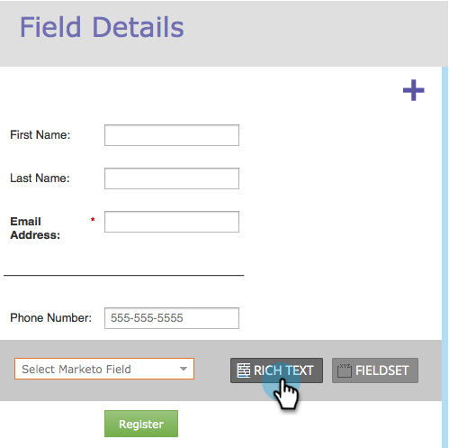
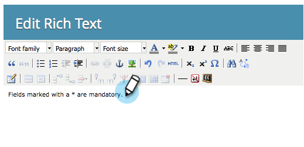

# Add Rich Text to a Form {#add-rich-text-to-a-form}

Use Rich Text in a Form to add instructions or other information in between fields. Check it out.

1. Go to **Marketing Activities**.

   

1. Select your form and click **Edit Form**.

   

1. Click the **+** sign.

   

1. Select **Rich Text**.

   

1. Enter the text you want.

   

   >[!TIP]
   >
   >If you need a line separator in your form, use the Horizontal Line button.

1. Click **Save**.

   

1. Click **Finish**.

   

1. Click **Approve and Close**.

   

   Nicely done! Check it out.

   

>[!TIP]
>
>Did you know you can also [add visibility rules](/help/marketo/product-docs/demand-generation/forms/form-fields/dynamically-toggle-visibility-of-a-form-field.md) to a rich text block?
