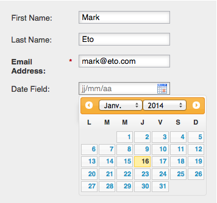

# Change a Form's Locale {#change-a-forms-locale}

When dealing with international forms, you will want to display dates/times in the correct formats. Marketo will do this automatically for you, all you have to do is set the form's locale and we take care of the rest.

1. Go to **[!UICONTROL Marketing Activities]**.

   

1. Select your form and click **[!UICONTROL Edit Form]**.

   

1. Under **[!UICONTROL Form Settings]**, click **[!UICONTROL Settings]**.

   

1. Select the **[!UICONTROL Form Locale]** of your choice.

   

1. Click **[!UICONTROL Finish]**.

   

1. Click **[!UICONTROL Approve and Close]** to apply and save changes.

   >[!NOTE]
   >
   >The form must be approved to be used on landing pages.

   

   >[!NOTE]
   >
   >Remember to [approve the landing page draft](/help/marketo/product-docs/demand-generation/landing-pages/understanding-landing-pages/approve-unapprove-or-delete-a-landing-page.md) created by the form changes.

   That's that! People can see date/time being displayed in the correct locale.

   
