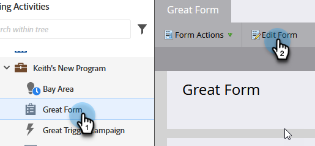

# Change the Language of a Form {#change-the-language-of-a-form}

Learn how to change the language of your form.

>[!IMPORTANT]
>
>Following the steps in this article will change the language of Marketo standard fields, as well as the wording used in the Submit Button label. It will not translate [custom fields](/help/marketo/product-docs/administration/field-management/create-a-custom-field-in-marketo.md){target="_blank"}.

1. Go to **Marketing Activities**.

   

1. Select your form and click **Edit Form**.

   

1. Click **Form Settings** and select **Settings**.

   

1. Select the desired **Form Language**.

   

   OPTIONAL STEP: Choose the Locale/Region of your selected language.

   

1. Click **Finish**.

   

1. Click **Approve and Close** to apply and save changes.

   

   >[!NOTE]
   >
   >The form must be approved to be used on Landing Pages.

   >[!TIP]
   >
   >Remember to [approve the Landing Page](/help/marketo/product-docs/demand-generation/landing-pages/understanding-landing-pages/approve-unapprove-or-delete-a-landing-page.md) draft created by the form changes.

Your form will now reflect the language you selected.

   
