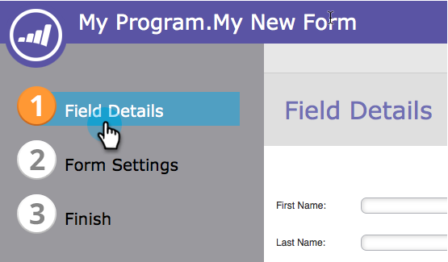
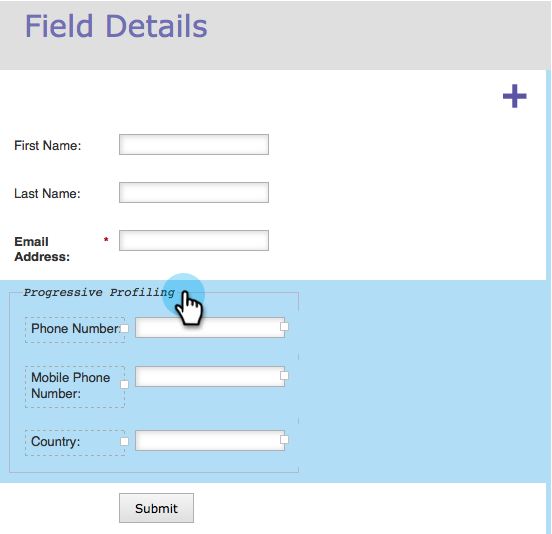
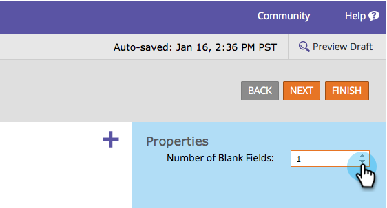

# Configure Form Progressive Profiling {#configure-form-progressive-profiling}

Short forms are good! When someone comes back to a form, you can present new fields and progressively fill out the profile of the visitor. Here's how.

>[!NOTE]
>
>For this feature to work properly, make sure Form Pre-Fill is enabled for visible fields, and [disabled](/help/marketo/product-docs/demand-generation/forms/form-fields/disable-pre-fill-for-a-form-field.md) for hidden fields.

1. Go to **Marketing Activities**.

   

1. Select your form and click **Edit Form**.

   

1. Under **Form Settings**, click **Settings**.

   

1. Set **Progressive Profiling** to **Enabled**.

   

1. Okay, now let's configure it. Go to **Field Details**.

   

1. Drag and drop all fields that are part of the progressive profile set.

   

1. When done moving all fields, it should look something like this:

   

   >[!NOTE]
   >
   >The fields outside of the **Progressive Profiling** box will always show in the form, even if they are filled out.

1. Select the **Progressive Profiling** box.

   

   >[!CAUTION]
   >
   >Be careful when using required fields in Progressive Profiling. Those fields could still be left blank if the visitor enters a new email address (which would create a new person) after previously submitting data for the other fields, as they would be suppressed on the latest form.

1. Now choose how many blank fields you want people to see from the **Progressive Profiling** box at any given time.

   

   >[!NOTE]
   >
   >If you choose **Number** **of** **Blank** **Fields** as 1, the visitor will see the following the first time they see this form:
   >
   >* First Name (empty)
   >* Last Name (empty)
   >* Email Address (empty)
   >* Phone Number (empty)
   >
   >Assuming they fill out every field, the second time they visit, they will see:
   >
   >* First Name (prefilled)
   >* Last Name (prefilled)
   >* Email Address (prefilled)
   >* Mobile Phone Number (empty)
   >
   >Assuming they fill out Mobile Phone Number, the third time they visit they will see:
   >
   >* First Name (prefilled)
   >* Last Name (prefilled)
   >* Email Address (prefilled)
   >* Country (empty)

1. Click **Finish**.

   

1. Click **Approve and Close**.

   

Nice job! The work you just did will pay off.

Experiment with this feature and be sure to test. It's advanced, but you can make your forms very dynamic this way.
