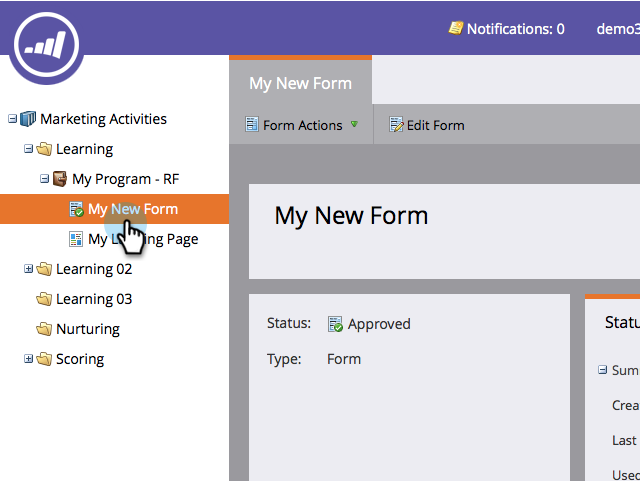
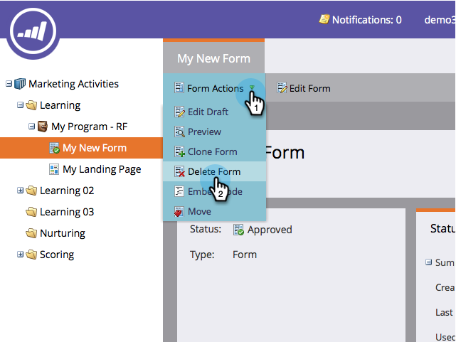

# Delete a Form {#delete-a-form}

If you have a form that you don't need and is not being used, you can delete it. Here's how.

1. Go to **Marketing Activities**.

   

1. Find and select your form.

   

1. Under **Form Actions**, click **Delete Form**.

   

   >[!NOTE]
   >
   >Remember to remove the form from any/all landing pages using it. Also, confirm that the form isn't being used on a public website.

1. Confirm by clicking **Delete**.

   

1. If the form is being used on a Marketo landing page, you won't be allowed to delete it. You have to go and remove it from whatever landing pages it lives on.

   

>[!CAUTION]
>
>If you delete a form that is being used by your public website, you won't see a warning and the form will be broken. Consider  [archiving it](/help/marketo/product-docs/email-marketing/drip-nurturing/using-stream-content/archive-and-unarchive-stream-content.md) instead.
