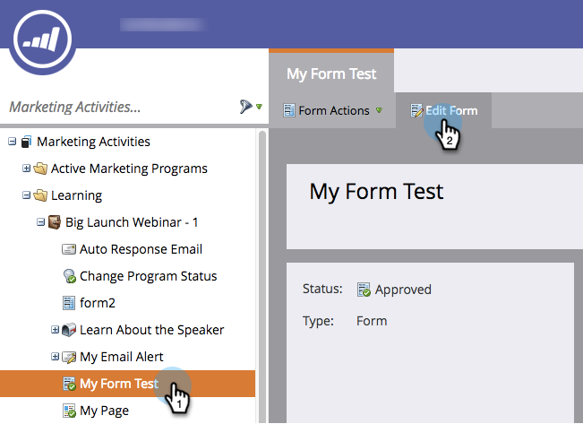

# Edit a Form {#edit-a-form}

If you want to make any changes to an existing form, here's how to get the process started.

1. Go to **Marketing Activities**.

   

1. Select your form and click **Edit Form**.

   

Simple!
