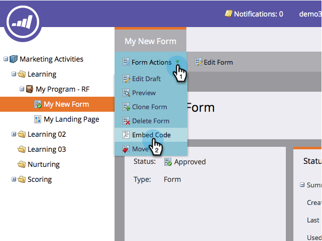
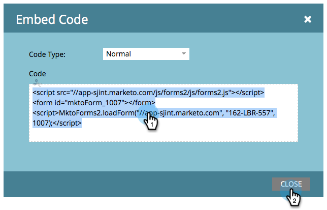

# Embed a Form on Your Website {#embed-a-form-on-your-website}

Embed a Form on Your Website - Marketo Docs - Product Documentation

Marketo allows you to embed our forms on your own website. Here's how to get access to the embed code.

1. Go to **Marketing** **Activities**.

   

1. Find and select your form. 

   

1. Under **Form** **Actions**, click **Embed** **Code**.

   >[!NOTE]
   >
   >**Reminder**
   >
   >
   >The form must be approved for the&nbsp;**Embed** **Code**&nbsp;item to be visible/usable.

   

   >[!CAUTION]
   >
   >** [Form Prefill](../../../../product-docs/administration/settings/edit-landing-page-settings.md)** does not work when using the form embed code on your own pages *or* a Marketo landing page. Form Prefill is only meant to work when the form is used in a Marketo landing page via the Insert Element option.

1. Select/Copy the embed code, then click **Close**.

   

>[!TIP]
>
>Once the code is embedded on your website, any changes to the form in Marketo will be pushed to your site upon form approval. You do not need to make more changes to the code.

##### Now simply give the embed code to your web developer and have them add it to your site. {#now-simply-give-the-embed-code-to-your-web-developer-and-have-them-add-it-to-your-site}

>[!NOTE]
>
>If your developer wants to customize the look or access advanced API functions, show them the&nbsp; [Forms 2.0 Developers Page](http://developers.marketo.com/documentation/websites/forms-2-0/).

Great job! Do you want the [embed code to include lightbox code](use-a-form-in-a-lightbox.md)? That's easy too!
