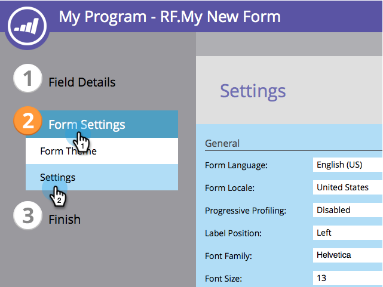

# Enable Social Form Fill on a Form {#enable-social-form-fill-on-a-form}

Allow your visitors to fill out the form using their social network. You will automatically get extra data and they get a quicker experience.

>[!AVAILABILITY]
>
>Not all customers have purchased this functionality. Contact your sales rep for details.

1. Go to **[!UICONTROL Marketing Activities]**.

   

1. Select your form and click **[!UICONTROL Edit Form]**.

   

1. Under **[!UICONTROL Form Settings]** click on **[!UICONTROL Settings]**.

   

1. Check the social network buttons you want to include.

   

   >[!TIP]
   >
   >Take a look at what [data Marketo will capture](/help/marketo/product-docs/demand-generation/social/social-functions/manage-social-profile-data.md) if people use the social buttons.

1. Click **[!UICONTROL Finish]**.

   

1. Click **[!UICONTROL Approve and Close]**.

   

   Here it is.

   

Pretty awesome, huh?
