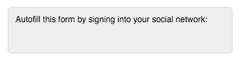

# [!DNL LinkedIn] Social Form Fill FAQs {#linkedin-social-form-fill-faqs}

[!DNL LinkedIn]'s revised API policy required us to remove [!DNL LinkedIn] Social Form Fill from our product.

## Important Things to Know {#important-things-to-know}

* [!DNL LinkedIn] Social Form Fill buttons were no longer an option to add to Marketo back on April 28, 2016

* We have removed the [!DNL LinkedIn] Social Form Fill button from all forms that had it enabled

## Why was this functionality removed from my Marketo subscription? {#why-was-this-functionality-removed-from-my-marketo-subscription}

LinkedIn made some significant changes to their developer program. As part of these changes, Marketo is no longer able to support this functionality for customers.

## What happened if I didn't remove the [!DNL LinkedIn] Social Form Fill buttons from my forms that had Social Form enabled? {#what-happened-if-i-didnt-remove-the-linkedin-social-form-fill-buttons-from-my-forms-that-had-social-form-enabled}

On April 28, 2016, we removed the [!DNL LinkedIn] Social Form Fill button from forms that still had Social Form enabled.

## I have been inserting this functionality on forms since we became a Marketo customer. How do I know which forms were using [!DNL LinkedIn] Social Form Fill? {#i-have-been-inserting-this-functionality-on-forms-since-we-became-a-marketo-customer-how-do-i-know-which-forms-were-using-linkedin-social-form-fill}

Before we made this change, we sent out weekly notifications to your notifications Inbox with a list of forms that used [!DNL LinkedIn] Social Form Fill. These alerts were meant to help you identify where you were using this functionality.

## Do [!DNL LinkedIn] Social Sharing buttons still work? {#do-linkedin-social-sharing-buttons-still-work}

Yes. The change only impacts the [!DNL LinkedIn] Social Form Fill functionality.

## Do [!DNL Facebook] and [!DNL Twitter] Social Form Fill still work? {#do-facebook-and-twitter-social-form-fill-still-work}

Yes. [!DNL Facebook] and [!DNL Twitter] Social Form Fill have not changed.

## Did anything happen to the data we already captured via [!DNL LinkedIn] Social Form Fill? {#did-anything-happen-to-the-data-we-already-captured-via-linkedin-social-form-fill}

No, this data was already stored on the person record in Marketo and was not impacted by this change.

## Where can I find more information about [!DNL LinkedIn]’s API policy? {#where-can-i-find-more-information-about-linkedin-s-api-policy}

Follow this link to learn more about the changes [!DNL LinkedIn] made to their API policy: [https://developer.linkedin.com/blog/posts/2015/developer-program-changes](https://developer.linkedin.com/blog/posts/2015/developer-program-changes)

## How can I contact [!DNL LinkedIn] with questions? {#how-can-i-contact-linkedin-with-questions}

Follow this link to contact [!DNL LinkedIn] about their Marketing Solutions: [https://business.linkedin.com/marketing-solutions/contact-us](https://business.linkedin.com/marketing-solutions/contact-us)

## If Marketo removed this functionality from my forms on April 28, were my forms and the affected landing pages put into draft mode? {#if-marketo-removed-this-functionality-from-my-forms-on-april-were-my-forms-and-the-affected-landing-pages-put-into-draft-mode}

No, your forms that we removed this functionality from remained published.

## If [!DNL LinkedIn] was my only selected network, will this change the appearance of my form? {#if-linkedin-was-my-only-selected-network-will-this-change-the-appearance-of-my-form}

No, we will only remove the [!DNL LinkedIn] button from your form. Whenever Social Form Fill is applied to a form, there is a container created above it that contains the Social Form Fill buttons. Before April 28, 2016, if [!DNL LinkedIn] was the only option, the container's appearance resembled this image:

After April 28, 2016, there is now an empty container left at the top of any form where [!DNL LinkedIn] Social Form Fill has been removed:

>[!NOTE]
>
>The above images are for example only. This may not be exactly how your Social Form Fill button container render. Any font color, style, etc. you have chosen influence what your container looks like.

## If [!DNL LinkedIn] was my only selected network, how can I remove the empty container above my form? {#if-linkedin-was-my-only-selected-network-how-can-i-remove-the-empty-container-above-my-form}

You can remove the empty container by editing the form, selecting [!DNL Facebook] or [!DNL Twitter] as an option for Social Form Fill, then de-selecting [!DNL Facebook] or [!DNL Twitter] as an option for Social Form Fill. This will reset the social options within the form fill container and remove it from your form.
