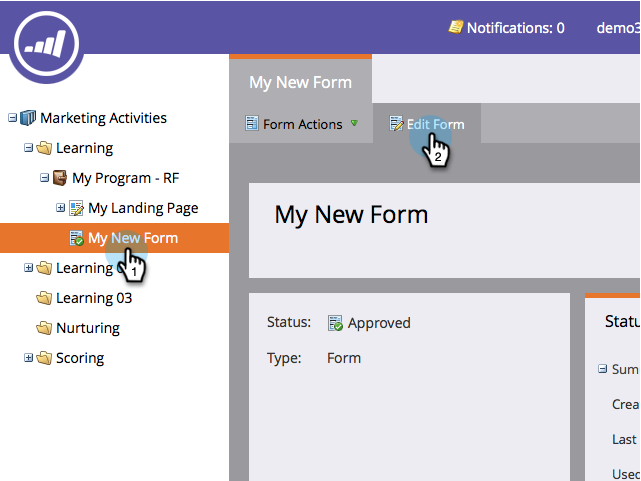
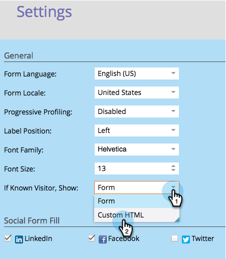
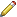
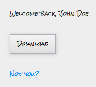

# Show Custom HTML Form for Known People {#show-custom-html-form-for-known-people}

If a visitor is cookied (known person who provided an email address in the past), then why bother with the form? Just give them the download button. Here's how.

1. Go to **[!UICONTROL Marketing Activities]**.

   

1. Under **[!UICONTROL Marketing Activities]**, select your form and click **[!UICONTROL Edit Form]**.

   

1. Under **[!UICONTROL Form Settings]**, click on **[!UICONTROL Settings]**.

   

1. Set If **[!UICONTROL Known Visitor, Show]**: to **[!UICONTROL Custom HTML]**.

   

1. Click the  to edit the **[!UICONTROL Custom HTML]** that will be shown to known people.

   

1. There's some default content, but feel free to change it up.

   

   Available tokens:

   | Token |Description |
   |---|---|
   | `{{lead.FirstName}}` |This will display the person's first name. |
   | `{{lead.LastName}}` |This will display the person's last name. |
   | `{{form.Button:default=Download}}` |This will display the form button. Replace the area after the `=` to change the button text. |
   | `{{form.NotYou:default=Not you?}}` |This will display a link in case the person is someone else. Replace the area after the `=` to change the link text. |

   >[!CAUTION]
   >
   >Only the four tokens above can be used. Any other token will not work here.

1. Click **[!UICONTROL Finish]**.

   

1. Click **[!UICONTROL Approve and Close]**.

   >[!NOTE]
   >
   >The form must be approved to be used on landing pages.

   

   >[!NOTE]
   >
   >Remember to [approve the landing page draft](/help/marketo/product-docs/demand-generation/landing-pages/understanding-landing-pages/approve-unapprove-or-delete-a-landing-page.md) created by the form changes.

   Piece of cake! Check out what a person would see if they came back to the same form:

   

   >[!TIP]
   >
   >You can direct the click of the button to the asset by setting the form follow-up page to the file's URL.
