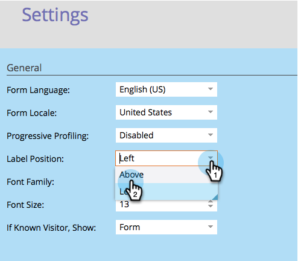
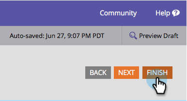
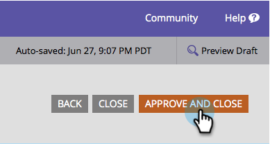

# Change Form Label Position {#change-form-label-position}

When [creating a form](/help/marketo/product-docs/demand-generation/forms/creating-a-form/create-a-form.md), you can change the positioning of the form field labels very easily. Here's how.

1. Go to **[!UICONTROL Marketing Activities]**.

   

1. Select your form and click **[!UICONTROL Edit Form]**.

   

1. Select **[!UICONTROL Settings]**.

   

1. Select the **[!UICONTROL Label Position]** you want.

   

   You currently have two options:

    * [!UICONTROL Left] (default)
    * [!UICONTROL Above]

1. Click **[!UICONTROL Finish]**.

   

1. Click **[!UICONTROL Approve and Close]**.

   >[!NOTE]
   >
   >The form must be approved to be used on landing pages.

   

   >[!NOTE]
   >
   >Remember to approve the landing page draft created by the form changes.

Well done! See how easy it was to change the label positions on a form? OK, let's see what we can do about changing the font of the form labels.

>[!MORELIKETHIS]
>
>[Change the Form Font Family](/help/marketo/product-docs/demand-generation/forms/form-design/change-the-form-font-family.md)
