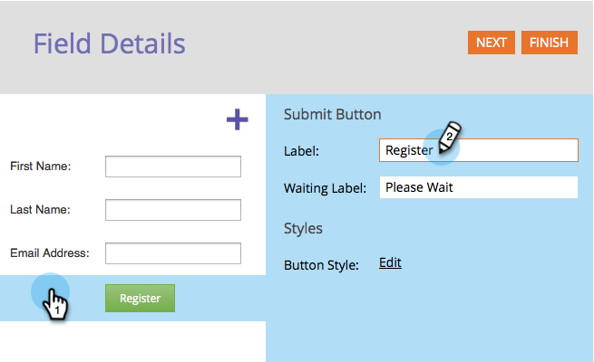
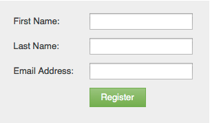

# Change Form Submit Button Text {#change-form-submit-button-text}

You can quickly and easily change a forms button from "Submit" to any other word. Here's how.

1. Go to **[!UICONTROL Marketing Activities]**.

   

1. Select your form and click **[!UICONTROL Edit Form]**.

   

1. Select the button and change the **[!UICONTROL Label]**.

   

   >[!TIP]
   >
   >Notice you can also change the Waiting Label. This displays after the button is clicked and before the form submit action is finished.

1. Click **[!UICONTROL Finish]**.

   

1. Click **[!UICONTROL Approve and Close]**.

   

   Bam!

   
