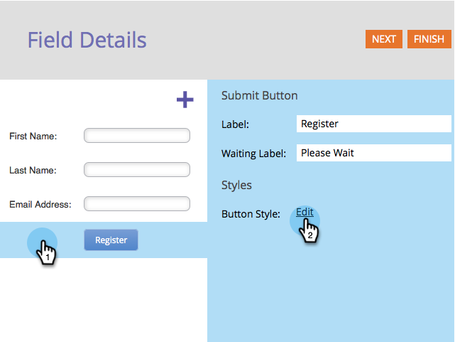
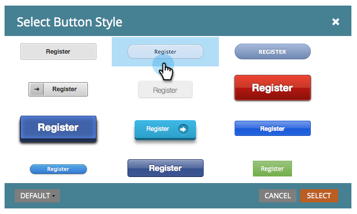
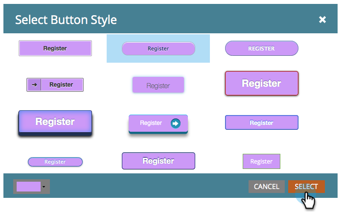
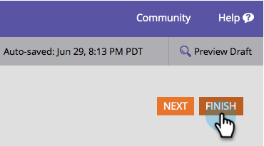
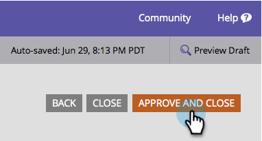
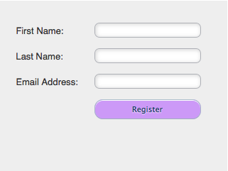

# Change Submit Button Style and Color {#change-submit-button-style-and-color}

Change Submit Button Style and Color - Marketo Docs - Product Documentation

If you find the standard submit button dull, or if you need something more fancy, feel free to choose from a wide range of ready-to-use button styles.

1. Go to **Marketing** **Activities**.

   

1. Select your form and click **Edit** **Form**.

   

1. Select the **Submit** button and click **Edit** next to Button Style.

   

   >[!TIP]
   >
   >Did you know you can drag the submit button to the left or right to change its position? It's that easy. Try it out!

1. Pick a button style you like (scroll up/down). 

   

1. You can leave the color as default or customize it.

   

   >[!TIP]
   >
   >You can also enter the color code manually.

1. Click **Select**.

   

1. Click **Finish**.

   

1. Click **Approve and Close**. 

   

   There you go!

   

   >[!NOTE]
   >
   >Like many graphical elements, the button may look different depending on which browser you're using.

