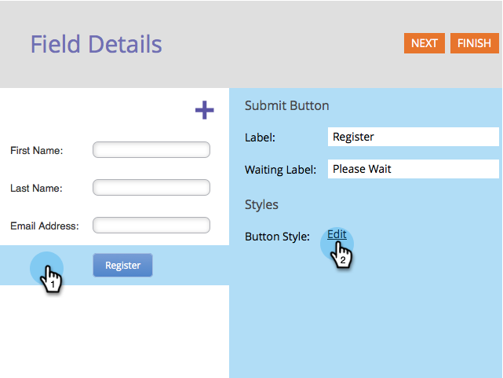
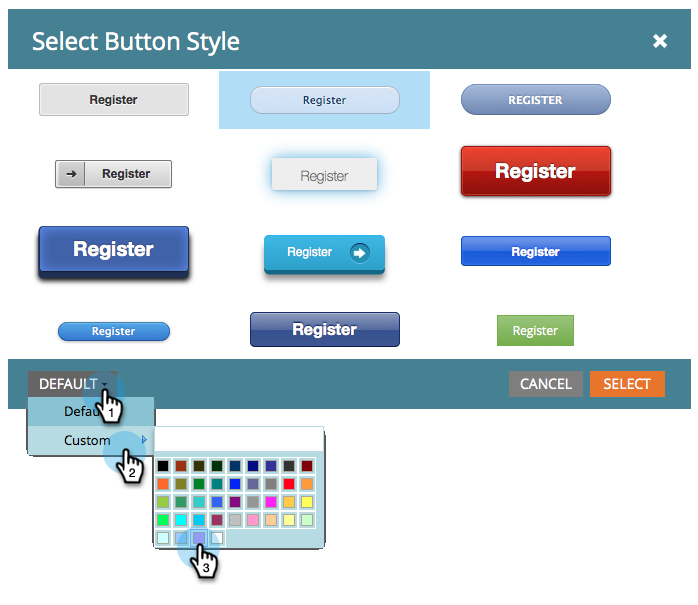

# Change Submit Button Style and Color {#change-submit-button-style-and-color}

If you find the standard submit button dull, or if you need something more fancy, feel free to choose from a wide range of ready-to-use button styles.

1. Go to **[!UICONTROL Marketing Activities]**.

   

1. Select your form and click **[!UICONTROL Edit Form]**.

   

1. Select the **[!UICONTROL Submit]** button and click **[!UICONTROL Edit]** next to Button Style.

   

   >[!TIP]
   >
   >You can drag the submit button to the left or right to change its position.

1. Pick a button style you like (scroll up/down).

   

1. You can leave the color as default or customize it.

   

   >[!TIP]
   >
   >You can also enter the color code manually.

1. Click **[!UICONTROL Select]**.

   

1. Click **[!UICONTROL Finish]**.

   

1. Click **[!UICONTROL Approve and Close]**.

   

   

   >[!NOTE]
   >
   >Like many graphical elements, the button may look different depending on which browser you are using.
