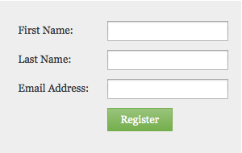

# Change the Form Font Family {#change-the-form-font-family}

Google Fonts are built into the form editor.

>[!NOTE]
>
>This setting impacts the form label, the input text, and any rich text.

1. Go to **[!UICONTROL Marketing Activities]**.

   

1. Select your form and click **[!UICONTROL Edit Form]**.

   

1. Under **[!UICONTROL Form Settings]**, select **[!UICONTROL Settings]**.

   

1. Select the **[!UICONTROL Font Family]** you want.

   >[!TIP]
   >
   >A bunch of [Google Fonts](https://fonts.google.com/){target="_blank"} are available for use.

   

1. Click **[!UICONTROL Finish]**.

   

1. Click **[!UICONTROL Approve and Close]**.

   >[!NOTE]
   >
   >The form must be approved to be used on landing pages.

   

   >[!NOTE]
   >
   >Remember to approve the landing page draft created by the form changes.

   

>[!MORELIKETHIS]
>
>[Change the Form Font Size](/help/marketo/product-docs/demand-generation/forms/form-design/change-the-form-font-size.md)
