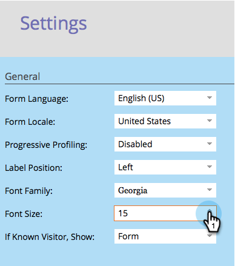
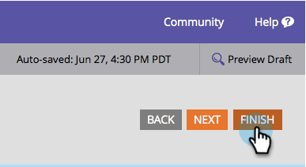
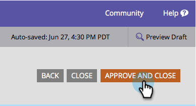
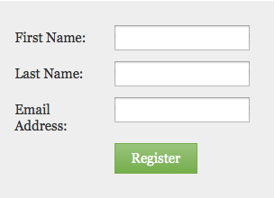

# Change the Form Font Size {#change-the-form-font-size}

Marketo makes it easy for you to customize the look and feel of your forms. One thing you may want to do is change the font size. Here's how.

>[!TIP]
>
>This setting impacts the form label, the input text, and the submit button text.

1. Go to **Marketing Activities**.

   

1. Select your form and click **Edit Form**.

   

1. Under **Form Settings**, Select **Settings**.

   

1. Select the **Font Size** you want.

   

1. Click **Finish**.

   

1. Click **Approve and Close**.

   >[!NOTE]
   >
   >The form must be approved to be used on landing pages.

   

   >[!NOTE]
   >
   >Remember to approve the landing page draft created by the form changes.

   

Piece of cake! You got this.
