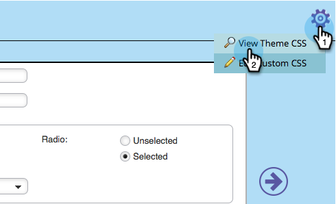

# Edit the CSS of a Form Theme {#edit-the-css-of-a-form-theme}

You have a few pre-built [themes you can just choose from](/help/marketo/product-docs/demand-generation/forms/creating-a-form/select-a-form-theme.md). But if you love editing CSS, you can make any changes you want. Here's how.

>[!NOTE]
>
>Make sure you know CSS if you want to try this, as Marketo Support is not set up to assist with custom coding. Also, any changes made will apply only to the form you're currently editing.

1. Go to **Marketing Activities**.

   

1. Select your form and click **Edit Form**.

   

1. Go to **Form Settings**.

   

1. Select the theme you want to make changes to.

   

1. Under the gear icon, click **View Theme CSS**.

   

1. Feel free to cut/paste this CSS to your own editor. It's read-only, so you will only need the override CSS.

   

1. Click **Close**.

   

1. Under the gear icon, click **Edit Custom CSS**.

   

1. Enter your custom CSS. You don't need all of it, just the parts that are different.

   

1. When you're done, click **Save**.

   

1. To see your customized form, click **Preview Draft**.

   

And that's that!
