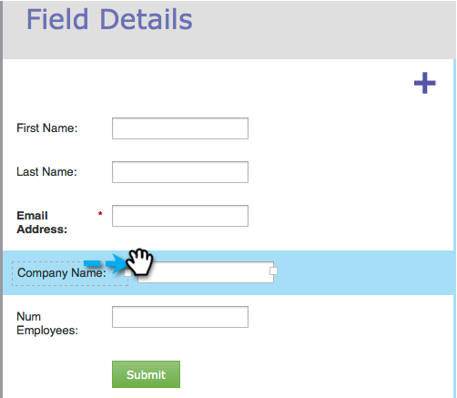
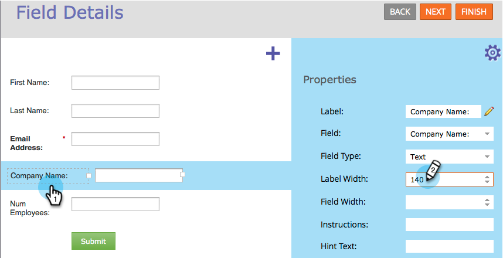

# Resize Label/Field Width in a Form {#resize-label-field-width-in-a-form}

There are two ways to resize both the field label width as well as the field width itself.

## Drag and Drop the Width {#drag-and-drop-the-width}

1. In the [form editor](/help/marketo/product-docs/demand-generation/forms/form-actions/edit-a-form.md), select the field you want to resize.

   

1. Drag the label corner or the field corner to resize.

   

## Enter the Width Manually {#enter-the-width-manually}

1. Select the field you want to resize.

   

1. Enter a pixel value for the Label Width and/or Field Width.

   

Great job! Pretty easy, right?
