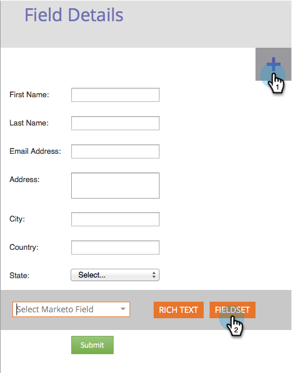
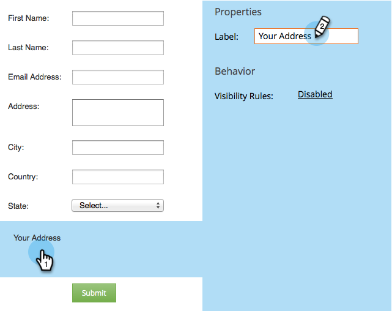
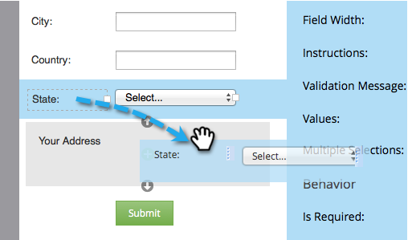
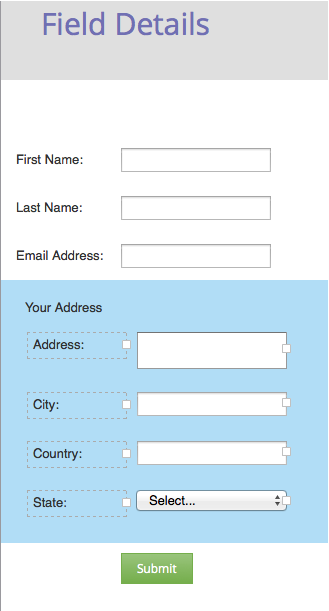

# Add a FieldSet to a Form {#add-a-fieldset-to-a-form}

Fieldsets are cool. They group a bunch of fields together. You can control a whole block at once too!

1. Go to **Marketing** **Activities**.

   

1. Select your form and click **Edit** **Form**. 

   

1. Click the **+** sign and select **Fieldset**. 

   

1. Select the **fieldset** and enter a **Label**.

   

1. Drag the fields you want into the **fieldset**. 

   

1. Here's what it should look like when done. 

   

There you have it!

>[!TIP]
>
>You can dynamically hide/show the entire fieldset depending on another field. Learn about [visibility rules](dynamically-toggle-visibility-of-a-form-field.md).

