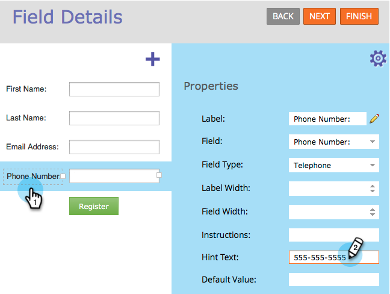
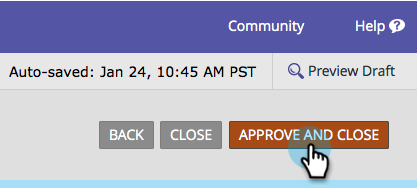
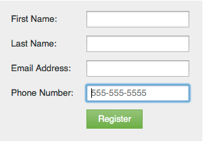

# Add Hint Text to a Form Field {#add-hint-text-to-a-form-field}

Hints and [instructions](/help/marketo/product-docs/demand-generation/forms/form-fields/add-tooltip-instructions-to-a-form-field.md) help people fill out forms. Here's how to add a hint.

>[!NOTE]
>
>**Definition**
>
>Form **Hints** is text inside the field that disappears when the visitor begins typing in the field.
>
>Form **Instructions** are little tooltips that show when the visitor hovers over the field.

1. Go to **Marketing Activities**.

   

1. Select your form and click **Edit Form**.

   

1. Select the field and enter your **Hint Text**.

   

1. Click **Finish**.

   

1. Click **Approve and Close**.

   

   >[!NOTE]
   >
   >Don't forget to [approve the landing page draft](/help/marketo/product-docs/demand-generation/landing-pages/understanding-landing-pages/approve-unapprove-or-delete-a-landing-page.md) created by the form changes.

   

Check it out! Let's go ahead and add some [instructions](add-tooltip-instructions-to-a-form-field.md) now.
