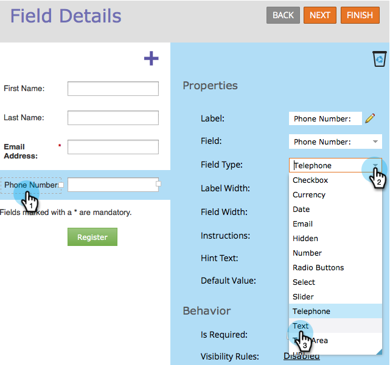
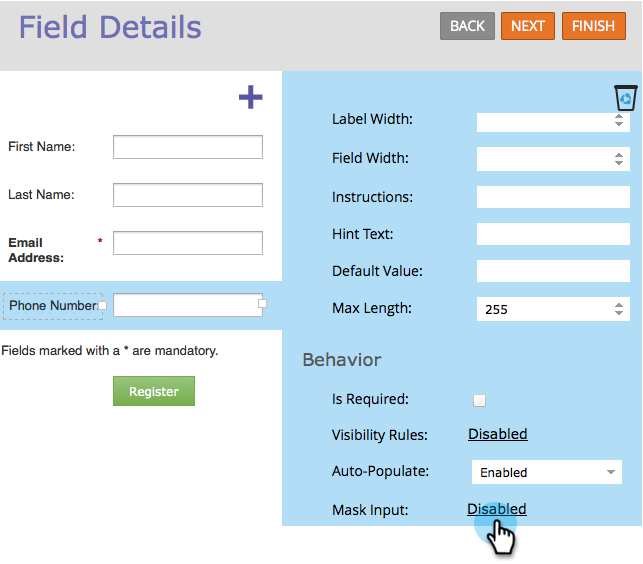
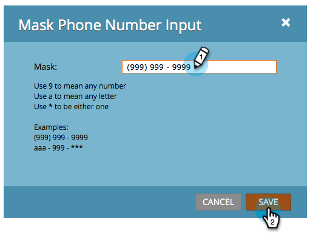
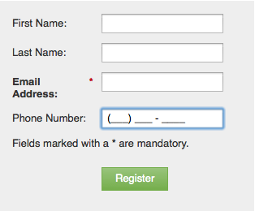

# Apply Input Masking to a Field in a Form {#apply-input-masking-to-a-field-in-a-form}

You can restrict input from your visitor using an input mask. For example, you may want visitors to enter phone numbers only in a specific format.

1. Go to **Marketing** **Activities**.

   

1. Select your form and click **Edit** **Form**.

   

1. Select your field and make sure the **Field** **Type** is set to **Text**.

   >[!NOTE]
   >
   >Input masking only works with&nbsp;**Text Field Types**.

   

1. Click the **Mask** **Input** link.

   

1. Enter your input mask and click **Save**.

   

   >[!NOTE]
   >
   >Pay attention to the masking rules. You can restrict input to numbers, letters, both, and/or even limit the number of characters entered.

1. Click **Finish**.

   

1. Click **Approve and Close**.

   

   Check it out! Now you're asking the visitor to enter numbers in a specific format.

   

   >[!NOTE]
   >
   >The field may not display pre-defined regions as shown in the image above. It may appear blank until the visitor starts entering numbers, which will then automatically adhere to the input format you defined for the field.

Pretty cool, huh?
