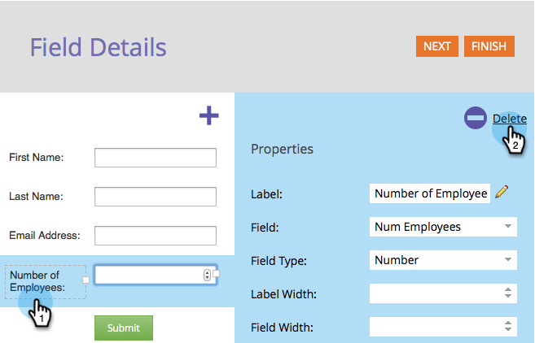
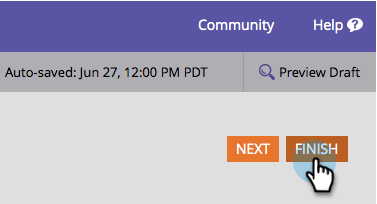
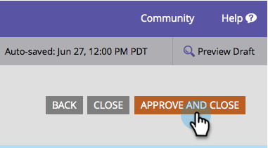

# Delete a Field in a Form {#delete-a-field-in-a-form}

If there's a field you no longer need on your form, it can easily be deleted. Here's how.

1. Go to **Marketing Activities**.

   

1. Select the form and click **Edit Form**.

   

1. Select your field and click the **delete** icon.

   

1. Click **Finish**.

   

1. Click **Approve and Close**.

   

>[!NOTE]
>
>Don't forget to [approve the landing page draft](/help/marketo/product-docs/demand-generation/landing-pages/understanding-landing-pages/approve-unapprove-or-delete-a-landing-page.md) created by the form changes.
