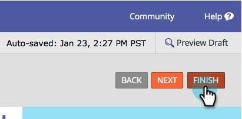
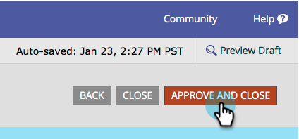
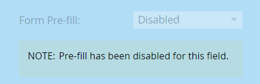

# Disable Pre-fill for a Form Field {#disable-pre-fill-for-a-form-field}

When a web visitor is known (cookied), Marketo forms will pre-fill fields with their information by default. If you want to turn this off, here's how to do it.

>[!NOTE]
>
>**Form Pre-fill** is enabled by default. Landing page level pre-fill settings and admin level pre-fill settings trump the form level setting:
>
>Form > Landing Page > Admin

## How to Disable Pre-fill {#how-to-disable-pre-fill}

1. Go to **[!UICONTROL Marketing Activities]**.

   

1. Select your form and click **[!UICONTROL Edit Form]**.

   

   >[!CAUTION]
   >
   >Form Pre-fill does not work when embedding a form on your own pages. It only works on Marketo landing pages.

1. Select one of the fields and set **[!UICONTROL Form Pre-fill]** to **[!UICONTROL Disabled]**.

   

   >[!TIP]
   >
   >You can also disable form pre-fill at the landing page level or at the admin level.

1. Click **[!UICONTROL Finish]**.

   

1. Click **[!UICONTROL Approve and Close]**.

   

## Sensitive Fields {#sensitive-fields}

When you [mark a field as sensitive](/help/marketo/product-docs/administration/field-management/mark-a-field-as-sensitive.md), preventing its values from being pre-filled in forms, you will see this on the Pre-fill option.

   
